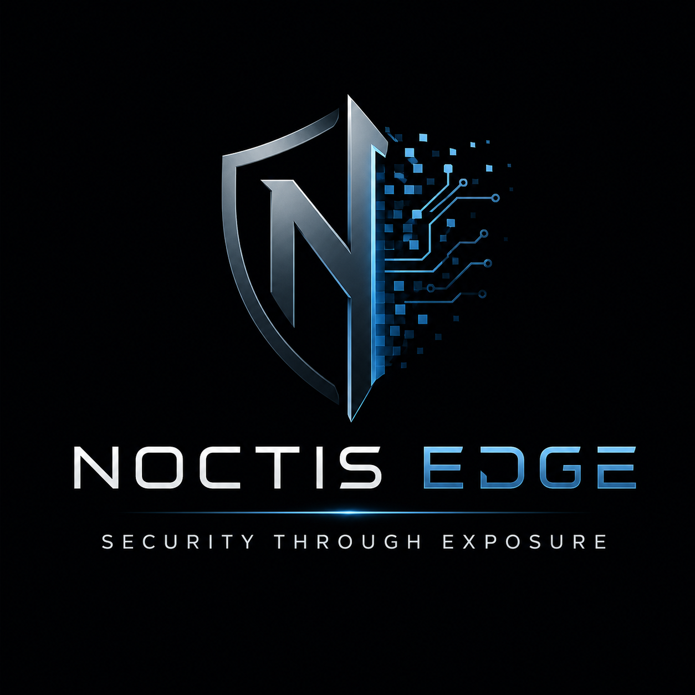

# Noctis Edge

<p align="center">
  
</p>

**Security Through Exposure**

Noctis Edge is a Python-based, AI-assisted penetration testing platform built with a strong focus on **local execution, data sovereignty, and operational security**.

Unlike cloud-dependent security platforms, **Noctis Edge runs entirely on the local machine**. All scanning, analysis, LLM-assisted testing, CVE validation, reporting, and evidence generation are performed on-device, ensuring that **no target data, credentials, vulnerability findings, or client-sensitive information ever leaves the host system**.

The platform conducts automated, LLM-guided penetration testing against a target environment, collects and verifies findings, generates professional HTML reports, and can optionally validate CVEs using Metasploit modules or locally generated probe scripts.

It supports both command-line execution via `noctis.py` and a browser-based Web UI via `noctis_web.py`, served locally on `http://127.0.0.1:5000`, without requiring external SaaS platforms, third-party APIs, or cloud processing.

This architecture makes Noctis Edge particularly suited for regulated environments, internal security teams, air-gapped networks, operational technology (OT) environments, and organizations where confidentiality and control are non-negotiable.

---

## System Requirements

| Component | Minimum |
|-----------|---------|
| **RAM** | 8 GB |
| **Storage** | 15 GB free |
| **CPU** | 4 cores |
| **OS** | Kali / Parrot / Ubuntu / Debian-based |
| **Python** | 3.10+ |

**Storage breakdown** (approximate):

| Item | Size |
|------|------|
| Ollama LLM model (`Qwen2.5-Coder-3B-Instruct`) | ~1.9 GB |
| Nuclei templates | ~1.5 GB |
| CVE offline database (built by `setup.sh`) | ~3–5 GB |
| SecLists wordlists (snap) | ~2 GB |
| Tool binaries + Python venv | ~1 GB |
| Scan session outputs | Variable |

> **RAM note:** The Qwen2.5-Coder-3B model requires ~2 GB of RAM to load and is optimized for code analysis and security testing. Inference is typically 2–5 seconds on modern hardware. 8 GB RAM is sufficient; 16 GB+ recommended for parallel processing.

---

## Initial Setup (new install)

> Full manual setup instructions: [Readme/requirements.md](Readme/requirements.md)

On a fresh Kali / Parrot / Debian-based machine, a single script handles everything:

```bash
git clone --recurse-submodules https://github.com/PearceTech335/Noctis-Edge.git
cd Noctis-Edge
chmod +x setup.sh
./setup.sh
```

`setup.sh` installs and configures (in order):

| Step | What gets installed |
|------|---------------------|
| Git submodules | `nikto/` — cloned from [sullo/nikto](https://github.com/sullo/nikto) |
| apt packages | `nmap`, `curl`, `gobuster`, `ffuf`, `hydra`, `ssh-audit`, `dnsenum`, `dnsrecon`, `perl`, `golang-go`, `python3-tk`, and more |
| SecLists | Wordlists via `snap install seclists` |
| Nuclei | Go-based template scanner (`~/go/bin/nuclei`) |
| Ollama | Local LLM server + pulls `qwen2.5-coder:3b-instruct` |
| Python venv | `.venv/` with `requests`, `jinja2`, `pycryptodome`, `flask`, `flask-sock` |
| CVE database | Clones `CVE/cve-offline/` and builds `cve-summary.csv` |
| rdpscan | Clones `rdpscan/` helper |
| Additional tools | `amass`, `metasploit-framework` |

After setup completes:
```bash
./noctis.py <target>   # Ollama starts automatically if not already running
# Optional browser-based Web UI:
./noctis_web.py
```

Run `./update.sh` to keep all components current.

---

## Quick Start

### Command Line

```bash
# Standard web scan:
./noctis.py 192.168.0.1

# Single profile:
./noctis.py 192.168.0.1 web

# Multiple profiles (tools from both are merged):
./noctis.py 192.168.0.1 web external

# Three profiles at once:
./noctis.py 192.168.0.1 web external api

# With CVE test scripts:
./noctis.py 192.168.0.1 web --cve-test

# No internet / DNS enumeration not needed (default — no flag required):
./noctis.py 192.168.0.1

# Opt in to DNS enumeration (requires internet):
./noctis.py 192.168.0.1 --dns-enum

# Full aggressive run:
./noctis.py 192.168.0.1 --aggressive --msf-validate --cve-test

# Resume an interrupted scan:
./noctis.py 192.168.0.1 --resume
```


### Web UI

A browser-based front-end is available for users who prefer to interact via a web browser. It features a VS Code dark colour scheme, profile and flag controls, and live terminal output streamed in real time via WebSocket.

```bash
./noctis_web.py
# Then open: http://127.0.0.1:5000

# Custom port:
./noctis_web.py --port 8080
```

The server binds to `127.0.0.1` only — it is not accessible from other machines on the network.

The Web UI provides:

- **Target** field with Enter-to-start support
- **Profiles** and **Flags** checkboxes
- Live colour-coded terminal output streamed via WebSocket (green `[+]`, amber `[!]`, red `[-]`, blue `[*]`)
- Spinner line updates for real-time progress
- **Prompt reply** bar with quick **Y** / **N** buttons for approval gates
- **Report** button to regenerate HTML from any existing JSON session file
- Logo watermark in the terminal area


| Feature | CLI | Web UI |
|---------|-----|--------|
| Profile selection | ✓ | ✓ |
| Flag checkboxes | ✓ | ✓ |
| Live terminal output | ✓ | ✓ (WebSocket) |
| y/n prompt replies | ✓ | ✓ |
| Regenerate report | ✓ | ✓ |

**Dependencies:** `flask` and `flask-sock` — installed automatically by `setup.sh` and kept up to date by `update.sh`.

---

## Command-Line Flags

| Flag | Description |
|------|-------------|
| `<target>` | IP address or hostname to scan (required) |
| `[profile]` | Assessment profile (default: `web`). See Profiles section below. |
| `--aggressive` | Disable safe mode — runs gobuster, ffuf, hydra without asking for approval |
| `--dns-enum` | Enable DNS enumeration tools (amass, dnsenum, dnsrecon) — disabled by default, requires internet access |
| `--msf-validate` | After scan, use Metasploit `check` commands to non-destructively validate each CVE match |
| `--cve-test` | After scan, use the LLM to generate and execute safe probe scripts for each matched CVE |
| `--unattended` | Auto-approve all interactive prompts — no user input required (useful for scripted/automated runs) |
| `--resume` | Resume the most recent interrupted scan session for this target |

---

## Assessment Profiles

Pass one or more profile names after the target. Tools from all selected profiles are merged into a single deduplicated list for the scan.

| Profile | Focus | Key Tools |
|---------|-------|-----------|
| `web` | Web Application Assessment | curl, nikto, nuclei, gobuster, ffuf |
| `external` | External Perimeter Review | nmap, curl, nuclei, gobuster, dns_enum |
| `internal_ad` | Internal AD Assessment | nmap, nxc (SMB/LDAP) |
| `api` | API Assessment | curl, nuclei, ffuf |
| `cloud` | Cloud Exposure Review | curl, nuclei, dns_enum |

---

## How It Works

### 1. Startup Checks
- Checks if Ollama is serving — starts `ollama serve` automatically if not
- Validates all tool binaries are present and prints a status table
- DNS enumeration tools (amass, dnsenum, dnsrecon) are disabled by default — pass `--dns-enum` to enable them
- Runs `nmap` against the target to discover open ports and services
- Searches the offline CVE database (`CVE/cve-offline/cve-summary.csv`) for matches on each service

### 2. LLM-Driven Scan — Phase 1 (Parallel)
Immediately after Nmap, Noctis Edge performs a **parallel initial scan wave**:

1. The LLM analyses all discovered services at once and returns a JSON array — one initial tool per service (e.g. `nikto` for HTTP, `ssh_enum` for SSH, `mysql_enum` for MySQL).
2. All actions in the wave run concurrently via `asyncio.gather()`, bounded by `MAX_PARALLEL_ACTIONS` (default 4) to avoid overwhelming the target.
3. Findings are enriched, verified, and auto-tagged before being passed into context for Phase 2.

### 3. LLM-Driven Scan — Phase 2 (Sequential loop)
The sequential loop continues deeper investigation, asking the LLM what to do next based on:
- Target, profile, and discovered services
- All findings collected in Phase 1 and so far in Phase 2
- History of tools already run
- List of disabled/broken tools

The LLM responds with a single JSON action `{"tool": "<name>", "args": "<value>"}`.
Noctis Edge executes the tool, parses structured findings from the output, and feeds results back into context for the next iteration.

Tools that time out with no findings or return error signals are auto-disabled for the session.
In `SAFE` mode (default), aggressive tools (gobuster, ffuf, hydra) require operator approval before running.

### 4. Finding Verification & Enrichment
After each tool run (Phase 1 and Phase 2), findings go through:
- **Verification** — re-requesting a discovered path to confirm it is real rather than a false positive.
- **Metadata enrichment** — inferring `vuln_type` (e.g. RCE, SQLi, XSS), `cwe_id` (e.g. CWE-89), and applicable `compliance_controls` (PCI-DSS, SOC2, ISO 27001) using the existing internal mapping tables.

### 5. Risk Scoring
Each finding is scored using:
```
risk_score = severity_weight × confidence × exposure × tool_confidence
```
- **severity_weight**: critical=1.0, high=0.8, medium=0.5, low=0.2, info=0.05
- **confidence**: set by the tool parser (e.g. curl=0.90, nikto=0.40)
- **exposure**: 1.2 if internet-facing, 1.0 internal
- **tool_confidence**: per-tool weighting from the config

### 6. Report Generation
After the scan loop, reports are saved to `sessions/<target>_<timestamp>/`:
- `report_<target>.json` — full machine-readable report
- `report_<target>.html` — styled HTML report with collapsible sections

Reports include:
- **Executive Summary** — severity counts at a glance
- **Compliance Impact** — badge chips for all implicated PCI-DSS / SOC2 / ISO 27001 controls, aggregated across findings and CVE matches
- **Service Inventory** — discovered services with CVE badge links
- **Findings** — expandable card per finding showing: severity, title, tool, risk score, verification status, vuln type, CWE, evidence, raw HTTP response (collapsible), command run, compliance controls, and clickable reference links
- **CVE Matches** — detailed CVE cards with CVSS vector, exploit maturity, compliance controls, and remediation references
- **MSF / CVE test results** (if run) and **LLM-generated conclusion**

### 7. Session Persistence
After each tool run the current state is saved to `sessions/<id>/session.json`. Use `--resume` to pick up where you left off after an interruption.

---

## Optional Phases

### `--msf-validate`
After the main scan, for each CVE matched against a service:
1. Searches Metasploit for a module matching the CVE ID
2. If found, runs `msfconsole -x "use <module>; set RHOSTS <target>; check; exit"` — this uses MSF's safe `check` command (no payload, no exploitation)
3. Result (`vulnerable`, `not vulnerable`, `unknown`, `no module`) is recorded in the report

Requires `msfconsole` on PATH. Requires operator approval in SAFE mode.

### `--cve-test`
After the main scan (and after `--msf-validate` if both are set):
1. Shows an approval prompt listing the CVEs to be tested
2. For each CVE, asks the LLM to generate up to **5 independent test scripts** (Python or Bash)
3. Each script is written to `sessions/<id>/cve_tests/` and executed with a 30-second timeout
4. Scripts must print one of: `VERDICT: VULNERABLE`, `VERDICT: NOT_VULNERABLE`, `VERDICT: INCONCLUSIVE`
5. Results are tallied into an overall per-CVE verdict and written into the reports

**Knowledge Base**: Results are persisted in `cve_knowledge_base.json` in the project root. On future runs, previously successful scripts for the same CVE are passed back to the LLM as context, improving quality over time. Running `./update.sh` automatically submits this file to the community repository via the Cloudflare relay — no token or account required.

**Verdicts**:
- `VULNERABLE` — at least 1 script returned VULNERABLE
- `NOT_VULNERABLE` — majority of scripts returned NOT_VULNERABLE with no VULNERABLE result
- `INCONCLUSIVE` — scripts ran but could not determine vulnerability status

> Note: These are heuristic probes generated by a small local LLM, not actual exploits. A VULNERABLE verdict means the probe's logic triggered — treat it as a lead to investigate, not a confirmed exploitation.

---

## In Operation

During a `--cve-test` run, the terminal displays each CVE under test in sequence, showing the method attempted (known-exploit replay from the knowledge base, LLM-generated probe, or both), the individual script verdicts, and the final per-CVE result. The LLM generates executable Python or Bash scripts in real time — the strategy and full source are printed to the terminal before execution so the operator can audit exactly what is being run against the target.

| CVE test loop — KB replay and LLM script generation | LLM-generated probe script printed before execution |
|---|---|
|  |  |

| LLM script source output | HTML report — executive summary |
|---|---|
|  |  |

On completion, the HTML report is generated with an executive summary stating the overall security posture, followed by sections covering the service inventory, findings ranked by risk score, CVE matches, validation results, and the LLM-generated conclusion. 

---

## Output Structure

```
sessions/
└── localhost_20260424_102554/
    ├── session.json              ← live state (for --resume)
    ├── report_localhost.json     ← full JSON report
    ├── report_localhost.html     ← styled HTML report
    └── cve_tests/
        ├── CVE-2002-1367_attempt_01.py
        ├── CVE-2002-1367_attempt_02.sh
        └── ...

cve_knowledge_base.json           ← cross-engagement CVE test KB (project root)
                                     gitignored locally; submitted to community
                                     repo automatically by ./update.sh
```

---

## Configuration (top of `noctis.py`)

| Constant | Default | Description |
|----------|---------|-------------|
| `MODEL` | `qwen2.5-coder:3b-instruct` | Ollama model to use (set `NOCTIS_OLLAMA_MODEL` environment variable to override) |
| `OLLAMA_URL` | `http://localhost:11434/api/generate` | Ollama API endpoint |
| `MAX_ITERATIONS` | `10` | Max Phase 2 sequential loop iterations |
| `MAX_PARALLEL_ACTIONS` | `4` | Max concurrent tools in the Phase 1 parallel wave |
| `MAX_LLM_RETRIES` | `3` | LLM call retries per iteration |
| `CVE_TEST_ATTEMPTS` | `5` | LLM script attempts per CVE in `--cve-test` |
| `SAFE_MODE` | `True` | Require approval for aggressive tools (override with `--aggressive`) |
| `UNATTENDED` | `False` | Auto-approve all prompts (override with `--unattended`) |

---

## Tools Used

| Tool | Purpose |
|------|---------|
| `nmap` | Port and service discovery |
| `curl` | HTTP probing |
| `nikto` | Web server vulnerability scanning (bundled in `nikto/`) |
| `nuclei` | Template-based scanning |
| `gobuster` | Directory brute-forcing |
| `ffuf` | Web fuzzing |
| `hydra` | Credential brute-forcing (aggressive only) |
| `ssh-audit` | SSH configuration auditing |
| `amass` | Subdomain enumeration (internet required) |
| `dnsenum` / `dnsrecon` | DNS enumeration (internet required, installed by `setup.sh`) |
| `nxc` (NetExec) | SMB/LDAP enumeration for AD assessments |
| `msfconsole` | MSF validation (`--msf-validate`) |
| `rdpscan` | RDP enumeration |

Install notes: see [Readme/requirements.md](Readme/requirements.md).

> **Note:** `nikto/` is a git submodule pointing to [sullo/nikto](https://github.com/sullo/nikto).
> Clone with `--recurse-submodules` or run `git submodule update --init --recursive` after cloning.

---

## Ollama Setup

Noctis Edge requires Ollama. `setup.sh` installs it and pulls the model automatically.

`noctis.py` will **automatically start `ollama serve`** if it is not already running — no manual step needed.

Manual install (if not using `setup.sh`):

```bash
# Install Ollama:
curl -fsSL https://ollama.com/install.sh | sh

# Pull the model:
ollama pull qwen2.5-coder:3b-instruct
```

Ollama will be started automatically by `noctis.py` on first use. The lightweight 3B model provides fast inference — typically 2–5 seconds per LLM call on modern hardware. The program prints a spinner while waiting.

---

## Application Maintenance

Run `./update.sh` to keep all components current.

```bash
./update.sh
```

This updates (in order):

| Step | What happens |
|------|--------------|
| 1 | apt packages upgraded |
| 2 | SecLists (snap) refreshed |
| 3 | pip dependencies upgraded |
| 4 | Nuclei binary + templates updated |
| 5 | Ollama model pulled |
| 6 | CVE offline database pulled + CSV rebuilt |
| 7 | Noctis Edge repository (`git pull`) |
| 8 | CVE Knowledge Base submitted to the community relay |

---

## CVE Knowledge Base

Noctis Edge accumulates CVE test results in `cve_knowledge_base.json` at the project root (created automatically on first `--cve-test` run). This file is machine-specific and anonymised — each entry is identified **only** by CVE ID; no target-specific information is recorded. This file is **not committed to the main git branch**.

Each time you run `./update.sh`, the knowledge base is automatically submitted to the community repository via a Cloudflare relay — no token or account required. Your installation ID (generated once by `./setup.sh` and stored in `noctis.conf`) is used only to rate-limit submissions (4 per day) and is never linked to personal data.

### How the relay works

The Cloudflare Worker (`cloudflare/worker.js`) acts as a server-side relay: it holds the GitHub credentials and writes the submitted JSON to the community repository on your behalf. The source code is included in this repository for full transparency — you can audit exactly what is done with your data.

### Unlocking the Community Knowledge Base

Subscribers receive access to the aggregated community CVE knowledge base — a curated collection of validated test scripts contributed by all Noctis Edge users. Once you have subscribed on [Polar.sh](https://polar.sh/PearceTech335) and received your license key:

1. Open `noctis.conf` in your Noctis Edge install directory.
2. Add or update the following line:
   ```ini
   KB_LICENSE_KEY=XXXX-XXXX-XXXX-XXXX
   ```
3. Run `./update.sh` — the community KB will be downloaded and merged into your local knowledge base automatically.

The community KB is pulled on every subsequent `./update.sh` run as long as a valid key is present. No other configuration is required.

---

## Scripts

| Script | Purpose |
|--------|---------|
| `setup.sh` | One-shot setup for a fresh install — run once after cloning. Also generates a unique installation ID stored in `noctis.conf`. |
| `update.sh` | Refresh of all components. On completion, automatically submits your local `cve_knowledge_base.json` to the community relay (no token required). |
| `scripts/submit_kb.py` | POSTs the local CVE knowledge base to the Cloudflare community relay. Called automatically by `update.sh`. |
| `scripts/merge_kb.py` | Additively merges an external knowledge base JSON into the local one (no data is overwritten or removed). |

---

## Cloudflare Relay

The `cloudflare/` directory contains the Cloudflare Worker that relays KB submissions to the community repository.

| File | Purpose |
|------|---------|
| `cloudflare/worker.js` | Worker source — validates, rate-limits, and writes submissions to GitHub |
| `cloudflare/wrangler.toml` | Wrangler deployment config (KV bindings, route) |
| `cloudflare/.gitignore` | Excludes `.wrangler/` cache (contains sensitive account credentials) |

The worker is already deployed at `https://noctis-kb-relay.pearcetechnologies1.workers.dev`. End users do not need to deploy anything — `update.sh` handles submission automatically.

---

## What Is NOT Committed to Git

The following are excluded from version control (see `.gitignore`):

| Path | Reason |
|------|--------|
| `sessions/` | Runtime scan output — local to each installation |
| `noctis.conf` | Per-user config (installation UUID, optional overrides) — never commit |
| `cloudflare/.wrangler/` | Wrangler cache containing Cloudflare account credentials |
| `WordLists/rockyou.txt` | 139 MB — not needed for directory enumeration |
| `CVE/cve-offline/cve-summary.csv` | 57 MB — regenerate with `updatecsv.sh` |
| `CVE/cve-offline/` | Separate git repo |
| `rdpscan/` | Separate git repo |

---

## Credits

Noctis Edge builds on and bundles a number of excellent open-source projects:

| Tool / Library | Author / Org | Purpose |
|----------------|-------------|---------|
| [Nikto](https://github.com/sullo/nikto) | Chris Sullo | Web server vulnerability scanner (bundled as submodule) |
| [Nuclei](https://github.com/projectdiscovery/nuclei) | ProjectDiscovery | Template-based vulnerability scanning |
| [nmap](https://nmap.org) | Gordon Lyon (Fyodor) | Network discovery and port scanning |
| [Gobuster](https://github.com/OJ/gobuster) | OJ Reeves | Directory and DNS enumeration |
| [ffuf](https://github.com/ffuf/ffuf) | Joona Hoikkala | Fast web fuzzer |
| [Hydra](https://github.com/vanhauser-thc/thc-hydra) | van Hauser / THC | Login brute-force testing |
| [ssh-audit](https://github.com/jtesta/ssh-audit) | Joe Testa | SSH configuration auditing |
| [Amass](https://github.com/owasp-amass/amass) | OWASP | Network attack surface mapping |
| [Metasploit Framework](https://github.com/rapid7/metasploit-framework) | Rapid7 | Exploitation framework for MSF validation |
| [rdpscan](https://github.com/robertdavidgraham/rdpscan) | Robert David Graham | RDP vulnerability scanning |
| [Ollama](https://ollama.com) | Ollama, Inc. | Local LLM server for AI-guided analysis |
| [trickest/cve](https://github.com/trickest/cve) | Trickest | CVE PoC reference database (bundled as submodule) |
| [trickest/cve-offline](https://github.com/trickest/cve-offline) | Trickest | Offline CVE CSV dataset |
| [SecLists](https://github.com/danielmiessler/SecLists) | Daniel Miessler | Security wordlists |
| [NetExec (nxc)](https://github.com/Pennyw0rth/NetExec) | Pennyw0rth | Network service execution and enumeration |
| [Flask](https://flask.palletsprojects.com) | Pallets | Web framework for the browser UI |
| [flask-sock](https://github.com/miguelgrinberg/flask-sock) | Miguel Grinberg | WebSocket support for Flask |
| [Requests](https://requests.readthedocs.io) | Kenneth Reitz | HTTP library |
| [Jinja2](https://jinja.palletsprojects.com) | Pallets | HTML report templating |
| [PyCryptodome](https://pycryptodome.readthedocs.io) | Legrandin | Cryptographic primitives |
