# Noctis Edge

<p align="center">
  
</p>

**Security Through Exposure**

Noctis Edge is a Python-based, AI-assisted vulnerability exposure and testing platform built with a strong focus on **local execution, data sovereignty, and operational security**.

Unlike cloud-dependent security platforms, **Noctis Edge runs entirely on your local machine**. All scanning, analysis, LLM-assisted testing, CVE validation, reporting, and evidence generation are performed on-device, ensuring that **no target data, credentials, vulnerability findings, or client-sensitive information ever leaves the host system**.

The platform conducts automated, LLM-guided penetration testing against a target environment, collects and verifies findings, generates professional HTML reports, and can optionally validate CVEs using Metasploit modules or locally generated probe scripts.

It supports both command-line execution via `noctis.py` and a browser-based Web UI via `noctis_web.py`, served locally on `http://127.0.0.1:5000`, without requiring external SaaS platforms, third-party APIs, or cloud processing.

This architecture makes Noctis Edge particularly suited for regulated environments, internal security teams, air-gapped networks, operational technology (OT) environments, and organizations where confidentiality and control are non-negotiable.

---

## What Gives Noctis the Edge

Most automated scanners tell you what CVEs *exist* on a system. **Noctis Edge tests whether they're actually exploitable** — and learns from every engagement it runs.

### Community-Driven Knowledge Base

The `--cve-test` flag instructs the local LLM to generate safe, targeted probe scripts for each CVE matched during the scan. These scripts run on-device with a strict timeout, print a clear `VULNERABLE` / `NOT_VULNERABLE` / `INCONCLUSIVE` verdict, and are written to the session folder so operators can audit exactly what was sent to the target.

What makes this platform more than a one-shot testing tool is the **community intelligence knowledge base**:

- Every probe script and its verdict is recorded in `cve_knowledge_base.json` at the project root
- On subsequent runs against the same CVE, **proven scripts are replayed first** — no LLM generation required — giving faster, higher-confidence results
- Running `./update.sh` automatically submits your local CVE and Tooling knowledge base to the community repository — no account, token, or cloud service required for submission. **No Target data or Environment variables leave your local machine** (See Community Knowledge Base section below). Submitted scripts are then vetted and validated to ensure no malicious code or potentially harmful actions can result from execution. Validated scripts and tooling knowledge contributed by other users are available to those with a [Noctis Edge Intelligence subscription](https://noctisedge.lemonsqueezy.com)
- The entire loop (generation → execution → verdict → submission → replay) stays on-device; nothing leaves the host without an explicit `./update.sh`. All CVE and Tooling knowledge are anonymised and identified only by either the CVE identifier or the service the tool ran against. **NO TARGET** data, information or identifiers ever leaves your device.

The result: **the more the community runs, the sharper the community becomes**.

### Tooling Intelligence

Alongside CVE probes, `tooling_knowledge_base.json` accumulates tooling knowledge — which tool invocations produced real findings versus noise, which scan techniques work reliably against specific service fingerprints, and which scripts generated false positives. The LLM uses this history as context on each new engagement, progressively improving the quality of tool selection and script generation over time. Your local tooling knowledge base grows continuously with every scan you run. Community-contributed tooling intelligence — aggregated across all users — is pulled down during `./update.sh` for those with a [subscription](https://noctisedge.lemonsqueezy.com) token set in `noctis.conf`.

---

## System Requirements

| Component | Minimum |
|-----------|---------|
| **RAM** | 8 GB |
| **Storage** | 15 GB free |
| **CPU** | 4 cores |
| **OS** | Kali / Parrot / Ubuntu / Debian-based |
| **Python** | 3.10+ |

| **Storage breakdown** (approximate):

| Item | Size |
|------|------|
| Ollama model — `qwen2.5-coder:3b-instruct` (planning + scripts) | ~2.0 GB |
| Ollama model — `qwen2.5:3b` (report prose) | ~2.0 GB |
| Nuclei templates | ~1.5 GB |
| CVE offline database (built by `setup.sh`) | ~3–5 GB |
| SecLists wordlists (snap) | ~2 GB |
| Tool binaries + Python venv | ~1 GB |
| Scan session outputs | Variable |

> **RAM note:** Three-role model split — `qwen2.5-coder:3b-instruct` (~2 GB) for planning and scripts; `qwen2.5:3b` (~2 GB) for report prose (conclusion, attacker perspective, remediation). Models are called sequentially so RAM peaks at one loaded model at a time. 8 GB RAM is sufficient; 16 GB+ recommended.

---

## Installation

Two installation paths are available — choose whichever suits your environment. Both paths provide identical functionality.

| | Docker | Native Linux |
|---|---|---|
| **OS** | Windows, macOS, Linux | Kali, Parrot, Ubuntu, Debian |
| **Setup time** | ~10 min (first build) | ~15 min |
| **Dependencies** | Docker Desktop only | apt + snap + Go + Ollama |
| **Isolation** | Full container isolation | System-level install |
| **Updates** | `docker compose build` + `pull` | `./update.sh` |

---

### Option A — Docker (Windows / macOS / Linux)

**Requirements:** [Docker Desktop](https://www.docker.com/products/docker-desktop/) (Windows or macOS) or Docker Engine + Compose plugin (Linux).

```bash
# 1. Clone the repo
git clone https://github.com/PearceTech335/Noctis-Edge.git
cd Noctis-Edge
```

**Linux / macOS:**
```bash
chmod +x docker-run.sh
./docker-run.sh
```

**Windows (PowerShell):**
```powershell
.\docker-run.ps1
```

The launcher script handles everything automatically:
1. Pulls the latest source (`git pull`)
2. Builds the Docker image — all scanning tools and the offline CVE database are baked in (~5–10 min first build; cached on subsequent runs)
3. Starts the Ollama sidecar and downloads the LLM model (~1.9 GB, one-time, stored in a Docker volume)
4. Starts the Noctis Edge Web UI

Open **http://localhost:5000** in your browser — no further configuration needed.

**Useful Docker commands:**
```bash
# Run a CLI scan (no web UI):
docker compose run --rm noctis scan 192.168.0.1
docker compose run --rm noctis scan 192.168.0.1 web --cve-test

# Stop all containers:
docker compose down

# View live logs:
docker compose logs -f noctis

# Rebuild after a git pull:
docker compose build && docker compose up -d
```

> **Network scanning note:** nmap inside Docker can reach targets on your local network. On Windows/macOS, Docker Desktop runs inside a VM — to scan the host machine itself use `host.docker.internal` instead of `127.0.0.1`.

> **GPU acceleration (optional):** Uncomment the `deploy.resources` block in `docker-compose.yml` to route Ollama inference through an NVIDIA GPU (requires `nvidia-container-toolkit` on the host).

---

### Option B — Native Linux Setup

> Full manual setup instructions: [Readme/requirements.md](Readme/requirements.md)

On a fresh Kali / Parrot / Debian-based machine, a single script handles everything:

```bash
git clone --recurse-submodules https://github.com/PearceTech335/Noctis-Edge.git
cd Noctis-Edge
chmod +x setup.sh
./setup.sh
```

`setup.sh` installs and configures (in order):

| Step | What gets installed |
|------|---------------------|
| Git submodules | `nikto/` — cloned from [sullo/nikto](https://github.com/sullo/nikto) |
| apt packages | `nmap`, `curl`, `ffuf`, `hydra`, `ssh-audit`, `dnsenum`, `dnsrecon`, `perl`, `golang-go`, `python3-tk`, and more |
| SecLists | Wordlists via `snap install seclists` |
| Nuclei | Go-based template scanner (`~/go/bin/nuclei`) |
| Ollama | Local LLM server + pulls `qwen2.5-coder:3b-instruct` (planning/scripts) and `qwen2.5:3b` (report prose) |
| Python venv | `.venv/` with `requests`, `jinja2`, `pycryptodome`, `flask`, `flask-sock` |
| CVE database | Clones `CVE/cve-offline/` and builds `cve-summary.csv` |
| Offline threat-intel DBs | Downloads EPSS scores (`CVE/epss-scores.csv`) and NVD CVSS data (`CVE/nvd-cvss.csv`) |
| rdpscan | Clones `rdpscan/` helper |
| Additional tools | `amass`, `metasploit-framework` |

After setup completes:
```bash
./noctis.py <target>   # Ollama starts automatically if not already running
# Optional browser-based Web UI:
./noctis_web.py
```

Run `./update.sh` to keep all components current.

---

## Quick Start

### Command Line

**Docker:**
```bash
# Standard web scan:
docker compose run --rm noctis scan 192.168.0.1

# With profile and flags:
docker compose run --rm noctis scan 192.168.0.1 web --cve-test
docker compose run --rm noctis scan 192.168.0.1 web external --aggressive

# Full aggressive run:
docker compose run --rm noctis scan 192.168.0.1 --aggressive --msf-validate --cve-test

# Resume an interrupted scan:
docker compose run --rm noctis scan 192.168.0.1 --resume
```

**Native Linux:**
```bash
# Standard web scan:
./noctis.py 192.168.0.1

# Single profile:
./noctis.py 192.168.0.1 web

# Multiple profiles (tools from both are merged):
./noctis.py 192.168.0.1 web external

# Three profiles at once:
./noctis.py 192.168.0.1 web external api

# With CVE test scripts:
./noctis.py 192.168.0.1 web --cve-test

# Opt in to DNS enumeration (requires internet):
./noctis.py 192.168.0.1 --dns-enum

# Full aggressive run:
./noctis.py 192.168.0.1 --aggressive --msf-validate --cve-test

# Resume an interrupted scan:
./noctis.py 192.168.0.1 --resume
```


---

## Command-Line Flags

| Flag | Description |
|------|-------------|
| `<target>` | IP address or hostname to scan (required) |
| `[profile]` | Assessment profile (default: `web`). See Profiles section below. |
| `--aggressive` | Disable safe mode — runs ffuf, hydra without asking for approval |
| `--dns-enum` | Enable DNS enumeration tools (amass, dnsenum, dnsrecon) — disabled by default, requires internet access |
| `--msf-validate` | After scan, use Metasploit `check` commands to non-destructively validate each CVE match |
| `--cve-test` | After scan, use the LLM to generate and execute safe probe scripts for each matched CVE |
| `--unattended` | Auto-approve all interactive prompts — no user input required (useful for scripted/automated runs) |
| `--resume` | Resume the most recent interrupted scan session for this target |

---

## Assessment Profiles

Pass one or more profile names after the target. Tools from all selected profiles are merged into a single deduplicated list for the scan.

| Profile | Focus | Key Tools |
|---------|-------|-----------|
| `web` | Web Application Assessment | curl, nikto, nuclei, ffuf |
| `external` | External Perimeter Review | nmap, curl, nuclei, ffuf, dns_enum |
| `internal_ad` | Internal AD Assessment | nmap, nxc (SMB/LDAP) |
| `api` | API Assessment | curl, nuclei, ffuf |
| `cloud` | Cloud Exposure Review | curl, nuclei, dns_enum || `ot` | Industrial / OT Assessment | nmap (OT-aware — skips ffuf/hydra/nuclei by default) |
---

## How It Works

### 1. Startup Checks
- Checks if Ollama is serving — starts `ollama serve` automatically if not (waits up to 30 seconds)
- If the configured model is not present locally, pulls it automatically via `ollama pull` before proceeding
- Validates all tool binaries are present and prints a status table
- DNS enumeration tools (amass, dnsenum, dnsrecon) are disabled by default — pass `--dns-enum` to enable them

### 2. Five-Phase Nmap Discovery

Before any LLM decisions are made, Noctis Edge runs a structured five-phase nmap pipeline that builds a complete, enriched picture of the target:

| Phase | nmap Command | Output |
|-------|-------------|--------|
| **Phase 1 — Host Discovery & Port List** | `-Pn -T4 --open -p- --min-rate 2000` | Asset list of all open TCP ports |
| **Phase 2 — Service & Version Enumeration** | `-sV -sC -T4 -p <ports>` | Service banners, version strings, product names |
| **Phase 3 — NSE Script Execution** | `--script <service-targeted NSE scripts>` | Per-service intelligence: HTTP headers/methods/auth, SSH algorithms, SMB shares, FTP anon, SSL ciphers, MySQL/MSSQL config, and more |
| **Phase 4 — OS Detection** | `-O --osscan-guess` | Operating system fingerprint with confidence % |
| **Phase 5 — Normalise** | (in-process) | All phase data merged into a unified service list; NSE output attached per port; OS context added to each service record |

Phase 3 uses a service-to-NSE script map to select the most decision-relevant scripts per service type — for example, an HTTP service gets `http-title,http-headers,http-methods,http-auth-finder,http-robots.txt` while an SSH service gets `ssh-auth-methods,ssh2-enum-algos,ssh-hostkey`. The complete NSE output is passed to the LLM as context in every subsequent planning prompt, enabling the LLM to choose specific paths, auth methods, and endpoint targets based on real probe data rather than guesswork.

CVE lookups run against the normalised service list after Phase 5 completes.

### 3. LLM-Driven Scan — Phase 1 (Parallel)
Immediately after nmap discovery, Noctis Edge performs a **parallel initial scan wave**:

1. The LLM analyses all discovered services at once — with NSE context included — and returns a JSON array: one initial tool per service (e.g. `nikto` for HTTP, `ssh_enum` for SSH, `mysql_enum` for MySQL).
2. All actions in the wave run concurrently via `asyncio.gather()`, bounded by `MAX_PARALLEL_ACTIONS` (default 4) to avoid overwhelming the target.
3. Findings are enriched, verified, and auto-tagged before being passed into context for Phase 2.

### 4. LLM-Driven Scan — Phase 2 (Sequential loop)
The sequential loop continues deeper investigation, asking the LLM what to do next based on:
- Target, profile, and discovered services
- NSE script results from nmap Phase 3
- All findings collected in Phase 1 and so far in Phase 2
- History of tools already run
- List of disabled/broken tools

The LLM responds with a single JSON action `{"tool": "<name>", "args": "<value>"}`.
Noctis Edge executes the tool, parses structured findings from the output, and feeds results back into context for the next iteration.

Tools that time out with no findings or return error signals are auto-disabled for the session.
In `SAFE` mode (default), aggressive tools (ffuf, hydra) require operator approval before running.

### 5. Finding Verification & Enrichment
After each tool run (Phase 1 and Phase 2), findings go through:
- **Verification** — re-requesting a discovered path to confirm it is real rather than a false positive.
- **Metadata enrichment** — inferring `vuln_type` (e.g. RCE, SQLi, XSS), `cwe_id` (e.g. CWE-89), and applicable `compliance_controls` (PCI-DSS, SOC2, ISO 27001) using the existing internal mapping tables.

### 6. Risk Scoring
Each finding is scored using:
```
risk_score = severity_weight × confidence × exposure × tool_confidence
```
- **severity_weight**: critical=1.0, high=0.8, medium=0.5, low=0.2, info=0.05
- **confidence**: set by the tool parser (e.g. curl=0.90, nikto=0.40)
- **exposure**: 1.2 if internet-facing, 1.0 internal
- **tool_confidence**: per-tool weighting from the config

### 7. Report Generation
After the scan loop, reports are saved to `sessions/<target>_<timestamp>/`:
- `report_<target>.json` — full machine-readable report
- `report_<target>.html` — styled HTML report with collapsible sections

Reports include:
- **Executive Summary** — severity counts at a glance
- **Compliance Impact** — badge chips for all implicated PCI-DSS / SOC2 / ISO 27001 controls, aggregated across findings and CVE matches
- **Service Inventory** — discovered services with CVE badge links
- **Findings** — expandable card per finding showing: severity, title, tool, risk score, verification status, vuln type, CWE, evidence, raw HTTP response (collapsible), command run, compliance controls, and clickable reference links
- **CVE Matches** — detailed CVE cards with CVSS vector, exploit maturity, compliance controls, and remediation references
- **MSF / CVE test results** (if run) and **LLM-generated conclusion**

### 7. Session Persistence
After each tool run the current state is saved to `sessions/<id>/session.json`. Use `--resume` to pick up where you left off after an interruption.

---

## Optional Phases

### `--msf-validate`
After the main scan, for each CVE matched against a service:
1. Searches Metasploit for a module matching the CVE ID
2. If found, runs `msfconsole -x "use <module>; set RHOSTS <target>; check; exit"` — this uses MSF's safe `check` command (no payload, no exploitation)
3. Result (`vulnerable`, `not vulnerable`, `unknown`, `no module`) is recorded in the report

Requires `msfconsole` on PATH. Requires operator approval in SAFE mode.

### `--cve-test`
After the main scan (and after `--msf-validate` if both are set):
1. Shows an approval prompt listing the CVEs to be tested
2. For each CVE, asks the LLM to generate up to **5 independent test scripts** (Python or Bash)
3. Each script is written to `sessions/<id>/cve_tests/` and executed with a 30-second timeout
4. Scripts must print one of: `VERDICT: VULNERABLE`, `VERDICT: NOT_VULNERABLE`, `VERDICT: INCONCLUSIVE`
5. Results are tallied into an overall per-CVE verdict and written into the reports

**Knowledge Base**: Results are persisted in `cve_knowledge_base.json` in the project root. On future runs, previously successful scripts for the same CVE are passed back to the LLM as context, improving quality over time. Running `./update.sh` automatically submits this file to the community repository via the Cloudflare relay — no token or account required for submission. Pulling the aggregated community knowledge base requires a subscription token.

**Verdicts**:
- `VULNERABLE` — at least 1 script returned VULNERABLE
- `NOT_VULNERABLE` — majority of scripts returned NOT_VULNERABLE with no VULNERABLE result
- `INCONCLUSIVE` — scripts ran but could not determine vulnerability status. The HTML report shows a **"Why INCONCLUSIVE?"** callout for each INCONCLUSIVE result explaining the specific cause (timeout, wrong protocol, banner-only probe, etc.) — see v0.7.1 notes.

> Note: These are heuristic probes generated by a small local LLM, not actual exploits. A VULNERABLE verdict means the probe's logic triggered — treat it as a lead to investigate, not a confirmed exploitation.

---

## In Operation

Noctis Edge ships with a browser-based web UI (`noctis_web.py`) providing point-and-click access to the full scan engine — no terminal required for day-to-day use. Select a target, choose scan profiles and flags, and launch. Live output streams directly into the built-in terminal panel via WebSocket so every tool invocation, LLM decision, and finding is visible in real time.

**Idle — ready to scan**

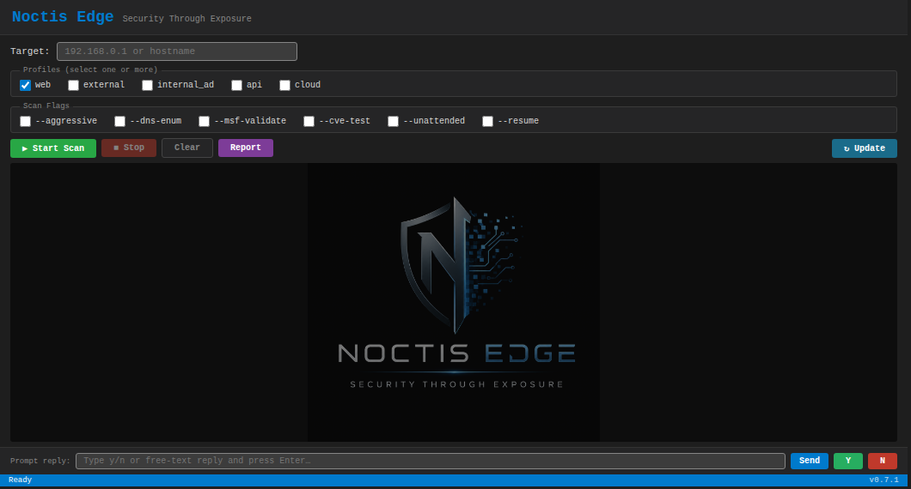

The interface loads with a clean dark theme. The target field, profile checkboxes (`web`, `external`, `internal_ad`, `api`, `cloud`), and scan flags (`--aggressive`, `--dns-enum`, `--msf-validate`, `--cve-test`, `--unattended`, `--resume`) are immediately accessible. The version badge in the footer always reflects the currently installed release.

---

**Configured and ready**

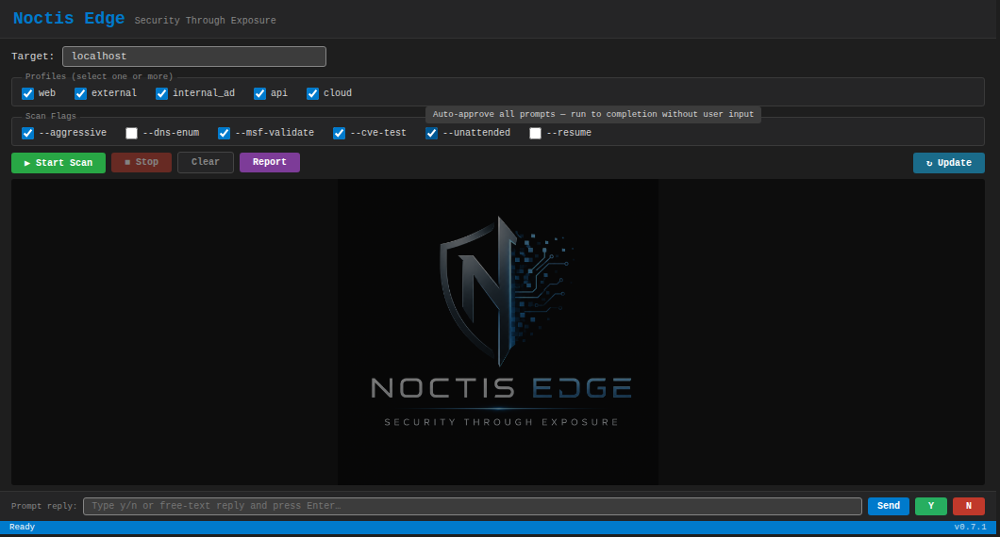

All five profiles selected alongside `--aggressive`, `--msf-validate`, `--cve-test`, and `--unattended`. The full command string is previewed in the command bar before the scan starts.

---

**Scan running — tool validation and nmap phases**

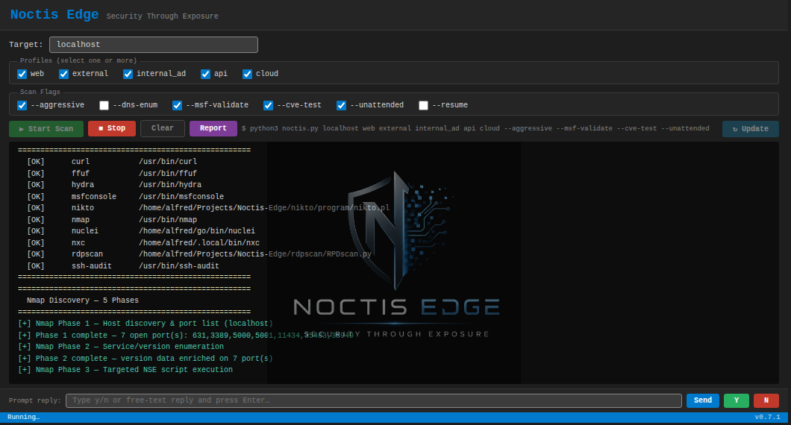

On launch, Noctis Edge verifies every tool dependency (`[OK]`) then moves immediately into the nmap discovery pipeline — host discovery, service/version enumeration, and targeted NSE script execution — with live output streaming to the terminal. The **Stop** button is active throughout.

---

**LLM agentic loop — parallel tool execution**

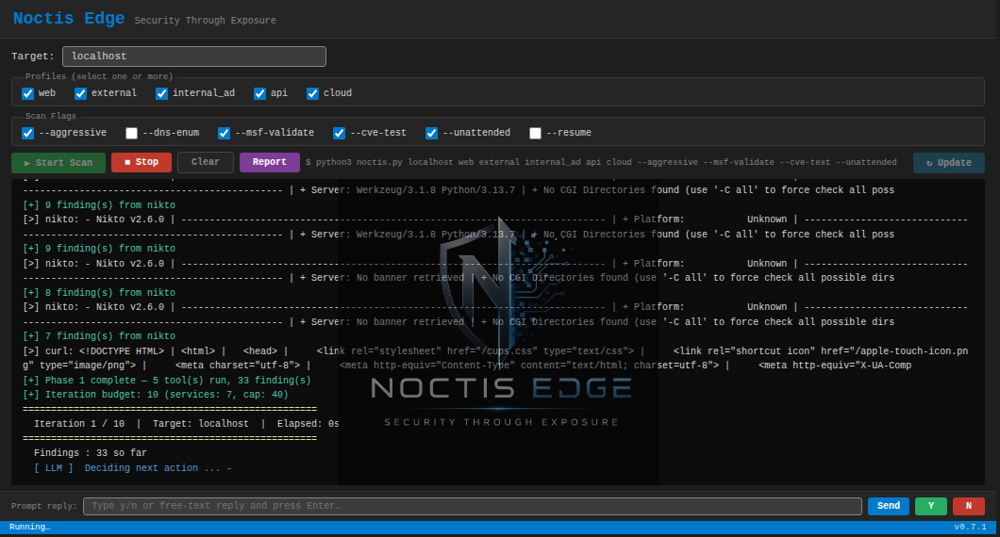

After the nmap and initial tool phases, the LLM agent takes over. It evaluates all findings so far, selects the next wave of tools, runs them concurrently, and loops up to the configured iteration budget. The iteration header shows the current loop count, elapsed time, and running findings total. `[ LLM ] Deciding next action ...` marks each decision point.

---

**Scan complete — stopped or finished**

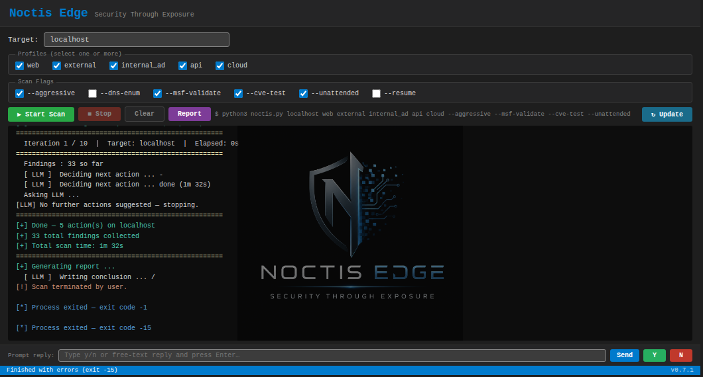

When the LLM exhausts its action budget or the operator clicks **Stop**, the terminal prints a completion summary — total actions taken, findings collected, and elapsed time — before the report generator runs. The **Start Scan** button re-enables and the status bar updates. The **Report** button opens the generated HTML report directly in the browser.

On completion, the HTML report is generated with an executive summary stating the overall security posture, followed by sections covering the service inventory, findings ranked by risk score, CVE matches, validation results, and the LLM-generated conclusion.

---

## Sample Report

The following screenshots are taken from a real Noctis Edge HTML report — a full scan of localhost running all five profiles (`web`, `external`, `internal_ad`, `api`, `cloud`) with `--msf-validate` and `--cve-test` enabled. Each section is described from the perspective of a penetration tester or security/network administrator.

---

### Report Header & Target Summary

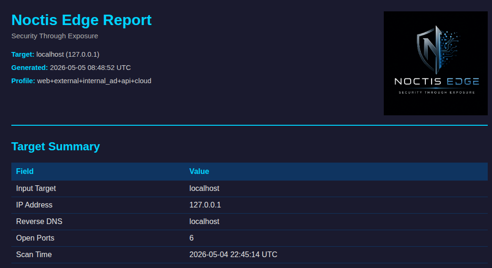

The report opens with target metadata — hostname, resolved IP, active scan profiles, timestamp, and the total number of open ports discovered. This gives the operator an immediate orientation to what was assessed and when, and provides the identifying information needed for inclusion in a pentest deliverable or incident record.

---

### Executive Summary — Risk Severity Dashboard

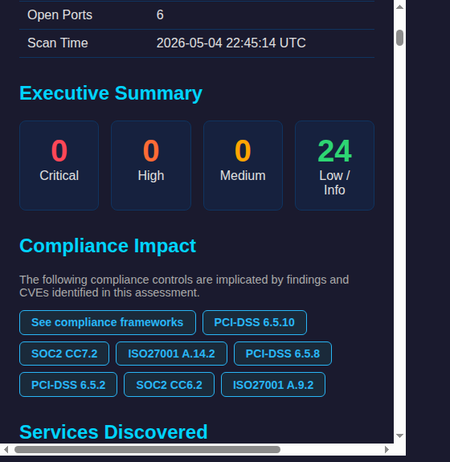

The executive summary presents a single-glance severity breakdown (Critical / High / Medium / Low / Info). This is the management-facing indicator — immediately answers "how bad is it?" without requiring the reader to parse technical detail.

---

### Compliance Impact

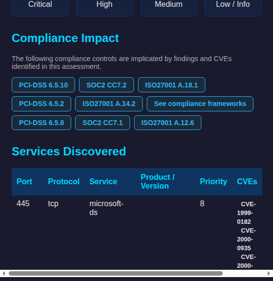

Every finding is automatically mapped to the regulatory controls it implicates — PCI-DSS, SOC2, ISO 27001, and others. This section is directly usable for audit preparation, gap analysis, or breach-notification triage without manual cross-referencing.

---

### Services Discovered — Attack Surface Inventory

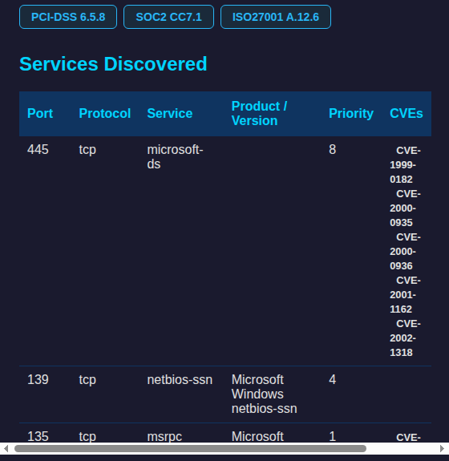

Every open port is listed with its protocol, service banner, detected product/version, a priority rank, and the number of CVEs mapped to that service. For a penetration tester this is the primary pivot table — it shows where to focus effort. For a network administrator it is a live inventory of exposed services that can be compared against an authorised-services baseline or firewall ruleset.

---

### Nmap NSE Results

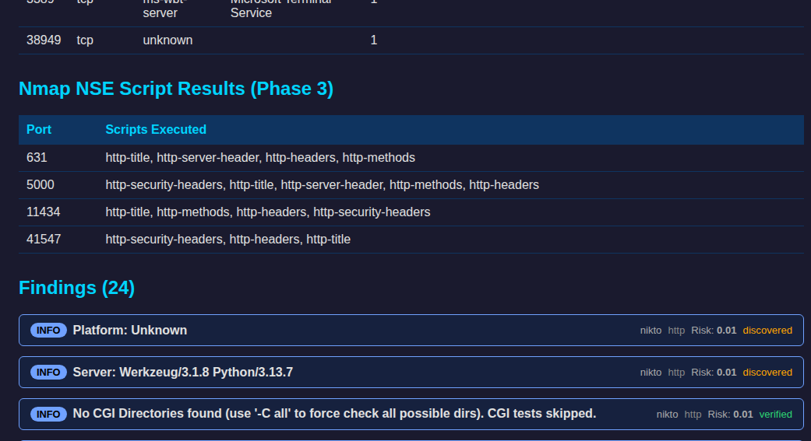

Phase 3 runs targeted Nmap Scripting Engine (NSE) scripts against each service. The scripts executed per port are listed alongside any notable output, feeding directly into the findings below.

---

### Findings — Confirmed Vulnerabilities

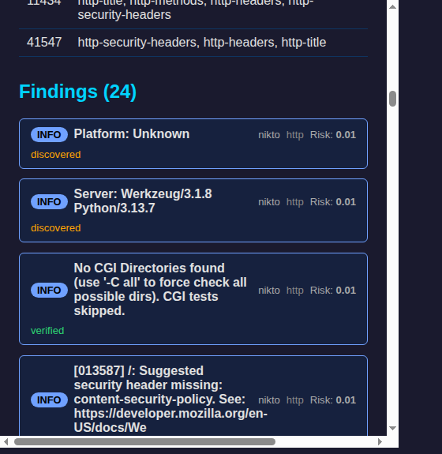

Findings represent technically confirmed issues — not just matches — surfaced from Nikto, Nmap NSE scripts, and curl probes. Each card shows severity badge, source tool, affected port/protocol, and risk score. This scan against localhost produced 24 findings, predominantly informational header and service-disclosure issues.

---

### Findings (continued)

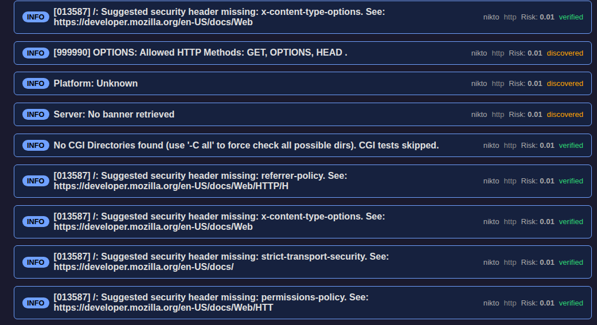

The findings list continues, with each entry showing the tool that surfaced it, the specific port and protocol, and a risk score. Items flagged `verified` have been confirmed via an active check; `discovered` items are detected but not actively verified.

---

### CVE Matches — Vulnerability Intelligence

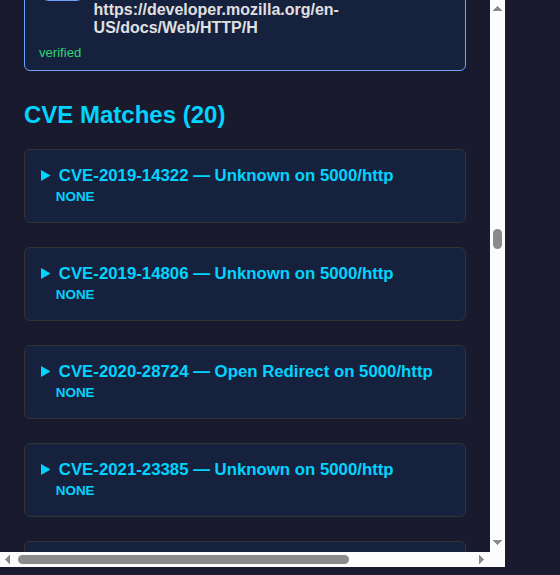

All CVEs matched to detected services are listed as expandable accordion entries. Each entry shows the CVE ID, vulnerability class, and the service/port it was mapped to. Penetration testers can use this list to prioritise further exploitation attempts; administrators can cross-reference it against their patch management records to identify unpatched exposure.

---

### Exploitation Validation — Metasploit Check Results

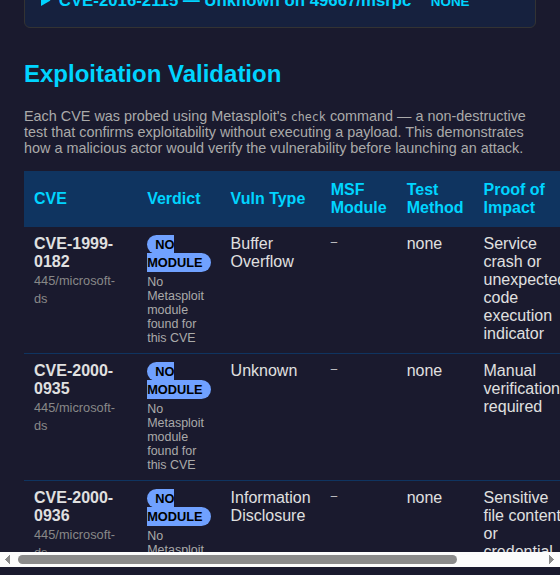

When `--msf-validate` is enabled, every matched CVE is probed using Metasploit's non-destructive `check` command. The table shows verdict (module found / no module), vulnerability type, the MSF module used, test method, and proof-of-impact description. This section provides exploitability evidence without executing a payload — the closest a non-destructive test can get to confirming a vulnerability is actively exploitable.

---

### CVE Test Results — Active Probe Verdicts

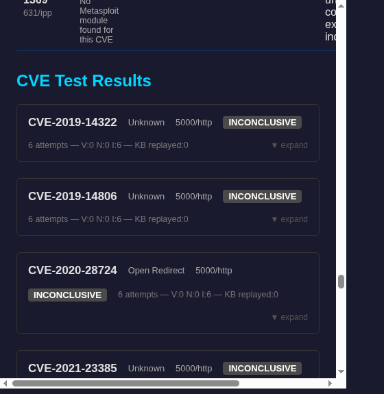

The CVE test results panel shows the outcome of every active probe run by `--cve-test`. Each entry displays the CVE, vulnerability class, target service, overall verdict (`VULNERABLE` / `INCONCLUSIVE` / `NOT_VULNERABLE`), attempt count, and a score breakdown (V:Vulnerable, N:Not Vulnerable, I:Inconclusive, KB:KB replays). Expanding an entry reveals the full script source, stdout/stderr, and per-attempt verdicts — giving the operator a complete audit trail from hypothesis to result.

---

### CVE Test Results — VULNERABLE Detection

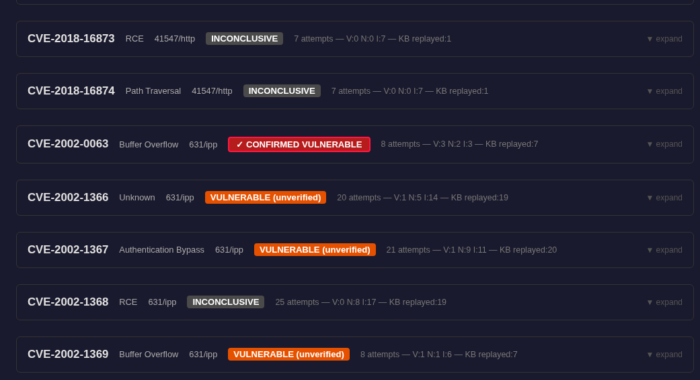

When a CVE is confirmed exploitable, the card is flagged `CONFIRMED_VULNERABLE` (red — multiple independent probes all returned VULNERABLE) or `VULNERABLE (unverified)` (orange — at least one probe returned VULNERABLE but not unanimously confirmed). Both badges indicate active exploitability; the distinction guides the operator on whether manual follow-up is needed to rule out false positives.

---

### Conclusion & Execution Log

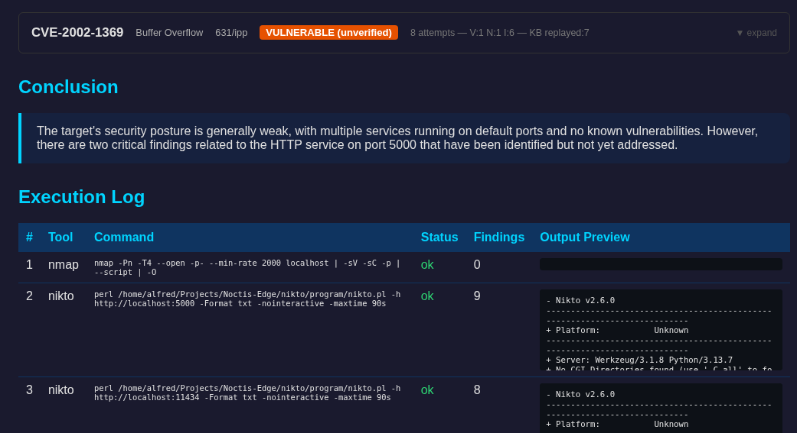

The conclusion is built from two parts: a deterministic first sentence constructed directly from the real finding counts (critical / high / medium / low) so the risk level is always factually accurate, followed by a single LLM-generated sentence recommending the most critical remediation action. The execution log records every tool invoked, the exact command run, its exit status, and the number of findings it contributed, providing a reproducible evidence chain.

---

### Execution Log (continued)

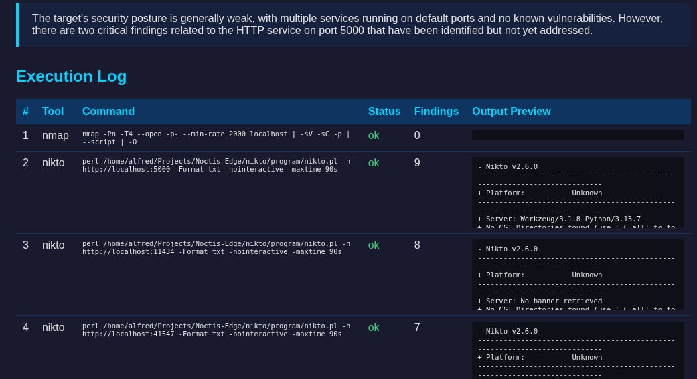

The full execution log lists every tool command run during the assessment with status and findings count, giving administrators and compliance officers a chain-of-custody record that can be independently reproduced or challenged.

---

## Output Structure

```
sessions/
└── localhost_20260424_102554/
    ├── session.json              ← live state (for --resume)
    ├── report_localhost.json     ← full JSON report
    ├── report_localhost.html     ← styled HTML report
    └── cve_tests/
        ├── CVE-2002-1367_attempt_01.py
        ├── CVE-2002-1367_attempt_02.sh
        └── ...

cve_knowledge_base.json           ← cross-engagement CVE test KB (project root)
                                     gitignored locally; submitted to community
                                     repo automatically by ./update.sh
```

---

## Configuration (top of `noctis.py`)

| Constant | Default | Description |
|----------|---------|-------------|
| `MODEL` | `qwen2.5-coder:3b-instruct` | Planning, iteration decisions, structured JSON tool selection (`NOCTIS_OLLAMA_MODEL` env var to override) |
| `SCRIPT_MODEL` | `qwen2.5-coder:3b-instruct` | CVE exploit scripts, test scripts, verification scripts (`NOCTIS_OLLAMA_SCRIPT_MODEL` env var to override) |
| `REPORT_MODEL` | `qwen2.5:3b` | Report conclusion, attacker perspective narratives, remediation guidance (`NOCTIS_OLLAMA_REPORT_MODEL` env var to override) |
| `OLLAMA_URL` | `http://localhost:11434/api/generate` | Ollama API endpoint |
| `MAX_ITERATIONS` | `10` | Max Phase 2 sequential loop iterations |
| `MAX_PARALLEL_ACTIONS` | `4` | Max concurrent tools in the Phase 1 parallel wave |
| `MAX_LLM_RETRIES` | `3` | LLM call retries per iteration |
| `CVE_TEST_ATTEMPTS` | `5` | LLM script attempts per CVE in `--cve-test` |
| `SAFE_MODE` | `True` | Require approval for aggressive tools (override with `--aggressive`) |
| `UNATTENDED` | `False` | Auto-approve all prompts (override with `--unattended`) |

---

## Tools Used

| Tool | Purpose |
|------|---------|
| `nmap` | Five-phase discovery: full port scan → service/version enumeration → targeted NSE scripts → OS detection → normalisation |
| `curl` | HTTP probing |
| `nikto` | Web server vulnerability scanning (bundled in `nikto/`) |
| `nuclei` | Template-based scanning |
| `ffuf` | Directory and web fuzzing (rate-limited, auto-calibrated) |
| `hydra` | Credential brute-forcing (aggressive only) |
| `ssh-audit` | SSH configuration auditing |
| `amass` | Subdomain enumeration (internet required) |
| `dnsenum` / `dnsrecon` | DNS enumeration (internet required, installed by `setup.sh`) |
| `nxc` (NetExec) | SMB/LDAP enumeration for AD assessments |
| `msfconsole` | MSF validation (`--msf-validate`) |
| `rdpscan` | RDP enumeration |

Install notes: see [Readme/requirements.md](Readme/requirements.md).

> **Note:** `nikto/` is a git submodule pointing to [sullo/nikto](https://github.com/sullo/nikto).
> Clone with `--recurse-submodules` or run `git submodule update --init --recursive` after cloning.

---

## Ollama Setup

Noctis Edge requires Ollama. `setup.sh` installs it and pulls the model automatically.

`noctis.py` will **automatically start `ollama serve`** if it is not already running — no manual step needed.

Manual install (if not using `setup.sh`):

```bash
# Install Ollama:
curl -fsSL https://ollama.com/install.sh | sh

# Pull the models:
ollama pull qwen2.5-coder:3b-instruct      # planning, tool decisions, CVE scripts
ollama pull qwen2.5:3b                     # report conclusion, attacker perspective, remediation
```

Ollama will be started automatically by `noctis.py` on first use. Three models handle distinct roles — keeping each model in its area of strength:

### Models

| Model | Environment variable | Purpose |
|-------|---------------------|---------|
| `qwen2.5-coder:3b-instruct` | `NOCTIS_OLLAMA_MODEL` | Tool selection, scan planning, structured JSON decisions |
| `qwen2.5-coder:3b-instruct` | `NOCTIS_OLLAMA_SCRIPT_MODEL` | CVE exploit scripts, verification scripts |
| `qwen2.5:3b` | `NOCTIS_OLLAMA_REPORT_MODEL` | Report conclusion, attacker perspective, remediation guidance |

All three models are ~2 GB each. They are called sequentially (never concurrently), so RAM peaks at one loaded model at a time. Inference is typically 20–90 seconds per call on CPU-only hardware after the initial warm load.

---

## Application Maintenance

Run `./update.sh` to keep all components current.

```bash
./update.sh
```

This updates (in order):

| Step | What happens |
|------|--------------|
| 1 | apt packages upgraded |
| 2 | SecLists (snap) refreshed |
| 3 | pip dependencies upgraded |
| 4 | Nuclei binary + templates updated |
| 5 | Ollama models pulled: `qwen2.5-coder:3b-instruct` (planning/scripts) + `qwen2.5:3b` (report prose) || 5a | EPSS offline database refreshed — daily exploit-probability scores (330k+ CVEs) |
| 5b | NVD CVSS offline database updated — real CVSS v3.1/v4.0 scores from NVD JSON 2.0 feeds || 6 | CVE offline database pulled + CSV rebuilt |
| 7 | Noctis Edge — `git fetch` + `git reset --hard origin/master` (always gets latest, even with local changes) |
| 8 | Nikto submodule — `git pull` inside `nikto/` (initialises submodule if missing) |
| 9 | CVE Knowledge Base submitted to the community relay |
| 10 | Tool Knowledge Base submitted to the community relay (pull community KB if `KB_LICENSE_KEY` set) |

> **Note on step 7:** `update.sh` uses `git fetch` + `git reset --hard origin/master` rather than `git pull`. This means it will **always** succeed and always result in the exact latest version from GitHub, even if there are local modifications. Any uncommitted local changes to tracked files will be discarded — this is intentional for an update script.
>
> **Your data is safe.** `git reset --hard` only affects files that git tracks. All user-generated data lives in gitignored files and will never be deleted by the update:
>
> | File / Directory | What the update does |
> |------------------|----------------------|
> | `cve_knowledge_base.json` | ✅ gitignored — `git reset --hard` never touches it. Subscribed users receive community KB entries **additively merged** in step 9 (new entries added, nothing overwritten or deleted). |
> | `tool_knowledge_base.json` | ✅ gitignored — `git reset --hard` never touches it. Subscribed users receive community tool KB entries **additively merged** in step 10 (new entries added, nothing overwritten or deleted). |
> | `noctis.conf` | ✅ gitignored — your UUID and license key are always preserved. |
> | `sessions/` | ✅ gitignored — all scan reports and session files are always preserved. |
---

## CVE Knowledge Base

Noctis Edge accumulates CVE test results in `cve_knowledge_base.json` at the project root (created automatically on first `--cve-test` run). This file is machine-specific and anonymised — each entry is identified **only** by CVE ID; no target-specific information is recorded. This file is **not committed to the main git branch**.

Each time you run `./update.sh`, the knowledge base is automatically submitted to the community repository via a Cloudflare relay — no token or account required for submission. Your installation ID (generated once by `./setup.sh` and stored in `noctis.conf`) is used only to rate-limit submissions (4 per day) and is never linked to personal data. Pulling the aggregated community knowledge base requires a subscription token — see [Unlocking the Community Knowledge Base](#unlocking-the-community-knowledge-base) below.

### How the relay works

The Cloudflare Worker (`cloudflare/worker.js`) acts as a server-side relay: it holds the GitHub credentials and writes the submitted JSON to the community repository on your behalf. The source code is included in this repository for full transparency — you can audit exactly what is done with your data.

### Unlocking the Community Knowledge Base

Subscribers receive access to the aggregated community CVE knowledge base — a curated collection of validated test scripts contributed by all Noctis Edge users. Once you have subscribed at [noctisedge.lemonsqueezy.com](https://noctisedge.lemonsqueezy.com) and received your license key:

1. Open `noctis.conf` in your Noctis Edge install directory.
2. Paste your license key:
   ```ini
   KB_LICENSE_KEY=XXXX-XXXX-XXXX-XXXX
   ```
3. Run `./update.sh` — the community KB will be downloaded and merged into your local knowledge base automatically.

The community KB is pulled on every subsequent `./update.sh` run as long as a valid license key is present. No GitHub account or PAT is required — the Cloudflare relay handles authentication server-side.

---

## Scripts

| Script | Purpose |
|--------|---------|
| `setup.sh` | One-shot setup for a fresh install — run once after cloning. Also generates a unique installation ID stored in `noctis.conf`. |
| `update.sh` | Refresh of all components. On completion, automatically submits your local `cve_knowledge_base.json` and `tool_knowledge_base.json` to the community relay (no token required for submission). |
| `scripts/submit_kb.py` | POSTs the local CVE knowledge base to the Cloudflare community relay. Called automatically by `update.sh`. |
| `scripts/merge_kb.py` | Additively merges an external CVE knowledge base JSON into the local one (no data is overwritten or removed). |
| `scripts/submit_tool_kb.py` | POSTs the local tool performance knowledge base to the Cloudflare community relay. Called automatically by `update.sh`. |
| `scripts/merge_tool_kb.py` | Additively merges an external tool knowledge base JSON into the local one (no data is overwritten or removed). |

---

## Cloudflare Relay

The `cloudflare/` directory contains the Cloudflare Worker that relays KB submissions to the community repository.

| File | Purpose |
|------|---------|
| `cloudflare/worker.js` | Worker source — validates, rate-limits, and writes submissions to GitHub |
| `cloudflare/wrangler.toml` | Wrangler deployment config (KV bindings, route) |
| `cloudflare/.gitignore` | Excludes `.wrangler/` cache (contains sensitive account credentials) |

The worker handles four routes:

| Route | Method | Purpose |
|-------|--------|---------|
| `/submit` | POST | CVE KB submission — writes to `Noctis-Edge-Submissions` repo |
| `/community-kb` | POST | CVE community KB pull — reads from `Noctis-Edge-KB` (Polar license check) |
| `/submit-tool` | POST | Tool KB submission — writes to `Noctis-Edge-Tool-Submissions` repo |
| `/community-tool-kb` | POST | Tool community KB pull — reads from `Noctis-Edge-Tool-KB` (Polar license check) |

The worker is already deployed at `https://noctis-kb-relay.pearcetechnologies1.workers.dev`. End users do not need to deploy anything — `update.sh` handles submission automatically.

---

## What Is NOT Committed to Git

The following are excluded from version control (see `.gitignore`):

| Path | Reason |
|------|--------|
| `sessions/` | Runtime scan output — local to each installation |
| `noctis.conf` | Per-user config (installation UUID, optional overrides) — never commit |
| `cloudflare/.wrangler/` | Wrangler cache containing Cloudflare account credentials |
| `WordLists/rockyou.txt` | 139 MB — not needed for directory enumeration |
| `CVE/cve-offline/cve-summary.csv` | 57 MB — regenerate with `updatecsv.sh` |
| `CVE/cve-offline/` | Separate git repo |
| `CVE/.nvd-cache/` | NVD CVSS download cache — large intermediate `.json.gz` files (excluded from Docker build context too) |
| `rdpscan/` | Separate git repo |

---

## Version History

## What's New in v0.7.4

---

### 📊 Significantly Improved HTML Reporting

The HTML report has been comprehensively updated to surface richer, more actionable intelligence without requiring operators to cross-reference external tools.

**CVE cards now link directly to NVD.** Every CVE ID in the report is a clickable hyperlink to `https://nvd.nist.gov/vuln/detail/CVE-XXXX-XXXXX`, giving one-click access to the full NVD advisory, scoring history, and patch links without leaving the report.

**Real NVD CVSS scores — v3.1 and v4.0.** Each CVE card now shows authoritative CVSS scores sourced from the offline NVD database rather than derived estimates. The score header badge is labelled `v3.1` or `v4.0` to make the standard immediately clear. Where NVD has published both, both are shown in the detail grid.

**EPSS exploitation probability badge.** An amber `EPSS X.X%` badge appears alongside every CVE that has a known EPSS score. The expanded card shows a dedicated EPSS row with exact probability and percentile rank (sourced from FIRST.org), giving operators instant signal on whether a CVE is likely to be exploited in the wild — not just theoretically severe.

**"The Fix" green one-liner.** A prominent green `THE FIX` block now appears at the top of every expanded CVE card, showing the short-term tactical workaround (firewall the port, add a WAF rule, rotate credentials, etc.) before any technical detail. This means operators can act immediately without reading the full card.

**CWE links to MITRE.** CWE identifiers in CVE cards are now hyperlinks to `https://cwe.mitre.org/data/definitions/<N>.html`, providing one-click access to the weakness definition, attack pattern mappings, and mitigations.

**OT environment banner.** When any service is classified as an operational technology asset (Modbus, S7comm, OPC-UA, DNP3, BACnet, EtherNet/IP, and 9 other protocols), a prominent orange warning banner appears at the top of the Services section advising operators to consult IEC 62443 and NERC-CIP before active testing.

**Type column in Services table.** A new `Type` column shows whether each service is classified as `OT` (orange pill badge) or `IT`. OT services include the matching protocol name as a tooltip (e.g. `Modbus — IEC 61511`).

---

**EPSS offline intelligence** — The platform now maintains a local copy of FIRST.org's Exploit Prediction Scoring System (EPSS) dataset. `setup.sh` and `update.sh` (step 5a) download daily scores (~330k CVEs) to `CVE/epss-scores.csv` via `scripts/build_epss_db.py`. Each CVE match is enriched with probability of exploitation in the wild and EPSS percentile rank, displayed in the report and available in the JSON output. The EPSS CDN publishes the daily file mid-afternoon UTC; a 3-day fallback ensures the download succeeds even when run early in the day. EPSS data is also baked into Docker images at build time (best-effort, non-fatal).

**NVD CVSS offline database** — Real CVSS v3.1 and v4.0 scores are loaded from a local NVD dataset (`CVE/nvd-cvss.csv`, built by `scripts/build_nvd_cvss.py`). The script incrementally downloads NVD JSON 2.0 feeds for 2002–current (~348k CVEs across 25 years), extracting Primary CVSS vectors and scores. The database is rebuilt on first run and refreshed incrementally on subsequent `update.sh` runs (step 5b) by checking each year's `.meta` staleness timestamp — only changed years are re-downloaded. The Docker entrypoint triggers a first-run background build automatically.

**NIST CSF 2.0 compliance mapping** — The internal `_COMPLIANCE_MAPPING` table now includes NIST Cybersecurity Framework 2.0 controls alongside PCI-DSS, SOC2, and ISO 27001. All 17 vulnerability types map to NIST CSF 2.0 functions (GV, ID, PR, DE, RS, RC) and specific control identifiers — for example `DE.CM-4` for detection, `RS.MI-2` for incident response mitigation, `PR.AA-1` for identity & access management. NIST CSF 2.0 chips appear in the report's Compliance Impact section.

**Industrial / OT profile** — A new `ot` assessment profile is available for industrial control system environments. The platform auto-classifies services using 15 OT/ICS protocol ports (S7comm/102, Modbus/502, OPC-UA/4840, DNP3/20000, BACnet/47808, EtherNet/IP/44818, and more) and a library of 20 OT vendor/product keywords (Siemens, Schneider, Rockwell, ABB, Honeywell, SCADA, HMI, PLC, DCS, RTU, and others). OT-classified services are annotated with `asset_type=OT`, `ot_protocol`, and `ot_standard` in the session JSON, and displayed with an orange badge pill in the Services table.

**Docker improvements** — `setup.sh` step 7b pre-fetches EPSS scores at image build time. `docker-compose.yml` adds a `./CVE:/app/CVE` bind mount so running `update.sh` on the host refreshes threat-intel data in-container without a rebuild. `docker-entrypoint.sh` now checks for EPSS staleness (>23h) and missing NVD CVSS on startup, triggering background refresh jobs. `CVE/.nvd-cache/` excluded from `.dockerignore`.

---

## What's New in v0.7.3

**Three-role model split** — a dedicated `REPORT_MODEL` (default: `qwen2.5:3b`) now handles all narrative prose tasks: report conclusion, attacker perspective blocks, and remediation guidance. `MODEL` and `SCRIPT_MODEL` remain `qwen2.5-coder:3b-instruct` for structured JSON planning and Python script generation respectively. The general language model produces coherent, factually consistent prose where the code-specialist model was prone to hallucinating contradictory natural-language statements. All three models are called sequentially (never concurrently), so RAM peaks at one loaded model at a time. Override via the `NOCTIS_OLLAMA_REPORT_MODEL` environment variable. `setup.sh`, `update.sh`, `docker-compose.yml`, and `docker-run.sh` all updated to pull and configure the third model.

**Deterministic conclusion anchor** — the first sentence of the conclusion is now built directly from the real finding counts (critical / high / medium / low) rather than asked of the LLM. This eliminates the class of hallucination where the model would describe a target with 15 high-severity findings as "having few vulnerabilities" or contradict its own risk label within the same paragraph. The LLM writes only the second sentence: a single remediation recommendation. The fallback (when Ollama is unreachable) is the anchor sentence alone — always factually accurate regardless of model availability.

**Payment platform migration** — subscription and license-key validation migrated from Polar.sh to Lemon Squeezy. The Cloudflare Worker now calls `POST https://api.lemonsqueezy.com/v1/licenses/validate` (public endpoint — no server-side auth token required) and checks `valid === true && license_key.status === "active"`. The two Polar secret bindings (`POLAR_ORG_ACCESS_TOKEN`, `POLAR_ORGANIZATION_ID`) have been removed from the worker entirely.

---

## What's New in v0.7.2

**Attacker perspective in CVE test results** — for every confirmed or likely vulnerable CVE, the HTML report now includes an *Attacker Perspective* block directly above the remediation guidance. Written by the LLM, it covers how a real threat actor would discover and exploit the vulnerability (access method, likely tooling, skill level required) and what they could gain from a successful exploit (exposed data, credential risk, lateral movement potential, business impact). The block is styled in amber/orange to visually distinguish threat context from the blue remediation guidance below it.

**Collapsible report sections** — the *Findings*, *CVE Matches*, and *Nmap NSE Script Results* sections in the HTML report are now collapsible. All three use a bright cyan expand header so they are clearly visible. CVE Matches defaults to collapsed (reduces scroll length on large-match reports); Findings and NSE results default to open. CVE Matches are sorted by CVSS score descending and each row includes a score badge.

**Resume session picker in Web UI** — a dedicated **↵ Resume** button sits in the toolbar alongside Start Scan and Stop. Clicking it opens a session picker modal (styled in amber/orange to distinguish it from the Report modal) listing every interruptible session found in the `sessions/` directory, sorted newest-first, with the target and last-known scan phase shown alongside each entry. Selecting a session and clicking **Resume Scan** passes the specific session directory directly to noctis via the new `--session-dir` flag, rather than always resuming the most recent session for that target. The `--resume` flag checkbox has been removed from the Scan Flags panel — `--resume` is now injected automatically when the Resume button is used. CLI behaviour is unchanged — `--resume` without `--session-dir` still auto-selects the most recent matching session.

**Phase 2 script execution parallelised** — LLM-generated CVE test scripts are still generated sequentially (each generation pass receives the strategies already planned, keeping probe diversity high), but all scripts are now executed concurrently via `asyncio.gather` rather than run one-at-a-time. Each probe has a 30-second execution timeout; under the old design, five probes could take up to 150 seconds of wall time in the worst case. Under the new design, all five run in parallel and complete within a single 30-second window — a worst-case reduction of approximately 60%.

---

## What's New in v0.7.1

**Automatic Ollama startup and model pull** — `noctis.py` now starts `ollama serve` automatically if it is not running and waits up to 30 seconds (up from 15 s) for it to become ready. If the configured model (`qwen2.5-coder:3b-instruct`) is not present locally, it is pulled automatically via `ollama pull` before the scan begins — no manual setup step required after a fresh install.

**Line-buffered output when piped** — `stdout` is now forced into line-buffering mode at startup (`sys.stdout.reconfigure(line_buffering=True)`), ensuring every log line appears immediately when noctis is run via a pipe or `tee` rather than being held in the OS pipe buffer until it fills.

**Single-model architecture** — `phi4-mini:3.8b` has been removed. `qwen2.5-coder:3b-instruct` now handles all LLM tasks: tool planning, iteration decisions, report prose, CVE remediation guidance, and CVE script generation. Running two models simultaneously on CPU-only hardware caused both to compete for RAM, forcing swap usage and collapsing generation speed to < 0.3 tok/s. The single 2 GB model fits entirely in available RAM and generates at 1–8 tok/s on typical CPU-only hosts.

**Deterministic fast-path tool selector** — a rule-based `_FAST_PATH` table maps well-known service name patterns to the correct tool without any LLM call. Covered services: `microsoft-ds` → `nxc_smb/445`, `netbios-ssn` → `nxc_smb`, `msrpc` → `curl`, `ssl/vmware-auth` / `vmware-auth` → `curl(https)`, `ssl/http` → `nikto(ssl)`, `http` → `nikto`, `ssh` → `ssh_enum`, `rdp` → `rdp_enum`, `ftp` → `curl`, `mysql` → `mysql_enum`, `mssql` → `mssql_enum`, `dns` → `dns_enum`, `ldap` → `nxc_ldap`. For targets where all services match (typical internal Windows/VMware hosts), the Phase 1 parallel scan runs entirely without LLM involvement, eliminating the main source of timeouts.

**Model keep-alive** — `keep_alive="1h"` is now sent with every Ollama request, and the same value is passed as `OLLAMA_KEEP_ALIVE` to the server environment when noctis.py spawns `ollama serve`. This ensures the model stays resident in RAM for the full scan duration, eliminating the 20–90 second cold-load penalty on every call.

**Inference options tightened** — `num_ctx` capped at 1024 (down from the 4096 default) for all planning calls; planning prompts are < 700 tokens so the smaller cache covers them fully while halving KV cache RAM usage. `temperature: 0` eliminates sampling overhead. `format: json` grammar-constrained decoding on all planning and CVE calls ensures the model outputs valid JSON without prose preamble.

**Model warm-start** — `_warmup_models()` fires a tiny prompt at each model before the scan begins, loading weights into RAM during the nmap discovery phase so the first real LLM call is warm.

**INCONCLUSIVE reason surfaced in reports** — when a CVE test result is `INCONCLUSIVE`, the HTML report now shows an amber ⚠ **"Why INCONCLUSIVE?"** callout directly on the CVE row (visible without expanding the attempt list) explaining the specific cause. Possible reasons include: all scripts timed out (port filtered or service slow), connection refused (wrong protocol probed), all probes were version-banner-only checks with no exact version string to compare, runtime errors caused by an HTTP probe targeting a non-HTTP service, LLM generation failure, or scripts that ran but produced no `VERDICT` token. The JSON report gains an `inconclusive_reason` field per CVE result. Existing session JSON files are automatically upgraded when the HTML report is regenerated — no re-scan required.

---

## What's New in v0.7.0

**Five-phase nmap discovery** — the single fast-port-scan call has been replaced with a structured five-phase nmap pipeline that runs before any LLM decisions are made:

- **Phase 1 — Host discovery & full port list**: `nmap -Pn -T4 --open -p- --min-rate 2000` scans all 65 535 ports with a fast-rate setting; falls back to a top-1000 scan if the full-range run returns nothing.
- **Phase 2 — Service & version enumeration**: `-sV -sC` with `--version-intensity 7` runs against only the open ports from Phase 1 — banner grabbing, version strings, product names, and default nmap scripts.
- **Phase 3 — Targeted NSE script execution**: a service-to-script map selects the most decision-relevant NSE scripts per service (e.g. `http-title,http-headers,http-methods,http-auth-finder,http-robots.txt` for HTTP; `ssh-auth-methods,ssh2-enum-algos,ssh-hostkey` for SSH; `smb-security-mode,smb-enum-shares` for SMB, and so on). Scripts are batched by service family to minimise nmap invocations. Full output is attached to each service record as `nse_output` (dict) and `nse_summary` (string).
- **Phase 4 — OS detection**: `-O --osscan-guess --max-os-tries 2` fingerprints the target OS and records name, accuracy, type, and vendor. Merged into `TargetInfo` so it appears in the report's Target Summary table.
- **Phase 5 — Normalisation**: all phase data is merged into a single unified service list. NSE output is attached per port; OS context is added to every service record so the LLM has full host context.

**LLM context enriched with NSE results** — the complete NSE output summary is injected into every LLM planning prompt (both the Phase 1 parallel planner and the sequential loop). The LLM can now choose specific URLs, paths, authentication methods, and tool arguments based on real nmap probe data rather than guesswork.

**HTML report updated** — a new *Nmap NSE Script Results* table is rendered in the report when Phase 3 produced output, listing each port and the scripts executed against it.

**Report metadata** — a `nmap_discovery` key is written to the JSON report containing `open_ports`, `os_detected`, and a `nse_summary` mapping of port → script IDs executed.

---

## What's New in v0.6.8

**Docker deployment fixes** — resolved several issues with the Docker install path that prevented clean first-run setups:

- **Ollama health check** — replaced `curl -sf http://localhost:11434/api/tags` with a pure-bash TCP probe (`bash -c '</dev/tcp/localhost/11434'`) in `docker-compose.yml`, `docker-run.sh`, and `docker-test.sh`. The official `ollama/ollama` image does not include `curl`, causing the health check to always fail and the `noctis` container to never start.
- `start_period` for the Ollama health check increased from `20s` to `45s` to allow enough time for the Ollama server process to initialise before health checks begin.
- **Model env vars corrected** — `docker-compose.yml` was using `NOCTIS_REPORT_MODEL` which is not a recognised env var in `noctis.py`. Replaced with the correct split-model variables: `NOCTIS_OLLAMA_MODEL=phi4-mini:3.8b` (planning) and `NOCTIS_OLLAMA_SCRIPT_MODEL=qwen2.5-coder:3b-instruct` (scripts). This aligns the Docker path with the native Linux path and the documented split-model architecture.
- **Disk space pre-flight** added to `docker-run.sh` (requires 8 GB free) and `docker-test.sh` (requires 2 GB free) — exits with a clear message rather than failing silently mid-build.
- **`exec -T` flag** added to all `docker compose exec` calls in `docker-run.sh` and `docker-test.sh` — required for non-interactive execution in scripts and CI environments.
- **Dockerfile Go cache cleanup** — `rm -rf /root/go/pkg/mod /root/go/pkg/cache /root/.cache/go-build` added after `go install` steps. The compiled binaries are retained in `/root/go/bin`; the module download and build caches (which can exceed 1 GB) are stripped, reducing the final image size.
- **`.dockerignore` expanded** — `CVE/cve/` (raw NVD JSON files, ~200 MB) excluded from the Docker build context. The container uses the pre-built `cve-offline/cve-summary.csv` at runtime; the raw JSON files are not needed in the image.
- **`docker-test.sh` model variable** — `REPORT_MODEL` renamed to `SCRIPT_MODEL` and mapped to `NOCTIS_OLLAMA_SCRIPT_MODEL`; defaults to the same value as `OLLAMA_MODEL` so the test suite only requires one model download.

---

## What's New in v0.6.7

**ffuf scoped to HTTP/HTTPS only** — ffuf is a directory fuzzer and is now dispatched only when the service is a genuine HTTP or HTTPS endpoint. Previously, `ipp` services (CUPS/printing on port 631) also triggered ffuf, which ran its full 300-second timeout budget against a printing protocol that returns no directory listings, inflating scan times by ~5 minutes per IPP port with zero findings.

- `_tools_for_service` split into two branches: `http/ssl` → `[curl, nikto, nuclei, ffuf]`; `ipp` → `[curl, nikto, nuclei]` (no ffuf)
- No other ffuf behaviour changed — it remains fully available for all web application targets
- No other tool removed from any service branch

**Tiered KB script selection with per-script success ranking** — as the community CVE Knowledge Base grows, a single CVE can accumulate hundreds of test scripts. Running every script on every scan would be impractical. Noctis now scores and ranks scripts based on their historical performance, then selects a fair tiered sample for each test run.

- Each KB script tracks `runs`, `vulnerable_count`, `not_vulnerable_count`, and `inconclusive_count` — updated every time the script is replayed
- `VULNERABLE` results are weighted **3×**, `NOT_VULNERABLE` **1×**, `INCONCLUSIVE` **0** — so scripts that reliably detect vulnerabilities rise to the top
- When a CVE has ≤ 20 KB scripts the full set is run (sorted by score); when the pool exceeds 20, exactly **20 scripts** are selected: **top-10 by rank** + **5 random mid-tier** + **5 random low-tier**
- The low-tier sample is intentional — previously low-scoring scripts are periodically re-validated against new targets and can climb the rankings over time
- The verdict line now shows `KB:20/150 replayed` so the full pool size is always visible
- Fully backward-compatible — existing KB entries without run stats fall back to their single recorded `verdict` field
- **Community confirmation bonus** — the build pipeline now stamps `community_confirmations: N` onto every script in the community KB (the count of independent users who submitted that exact script hash). `_script_score()` adds +0.5 per confirmation beyond the minimum-2 required for inclusion, so a script confirmed by 10 users arrives pre-ranked above an untested local script. Run stats and confirmation bonus stack, so locally-validated scripts still earn their position over time.

**Tool Knowledge Base community pipeline** — mirrors the existing CVE KB pipeline with a parallel infrastructure for tool performance data:

- `scripts/submit_tool_kb.py` — submits `tool_knowledge_base.json` to the community relay via `/submit-tool`
- `scripts/merge_tool_kb.py` — additively merges community tool KB into the local file
- `cloudflare/worker.js` extended with `/submit-tool` and `/community-tool-kb` routes (same rate-limiting, same Polar license gate for pull)
- `update.sh` step 9/9 added — submits and pulls tool KB alongside the existing CVE KB step
- Submissions pipeline added to `Noctis-Edge-Tool-Submissions` GitHub repo (validate + build workflows)

---

## What's New in v0.6.6

**Split-model architecture** — CVE script generation now uses `qwen2.5-coder:3b-instruct` (code-specialist model) while planning, iteration decisions, report prose, and remediation guidance continue using `phi4-mini:3.8b`.

- `SCRIPT_MODEL` constant added — controls the script generation model (`NOCTIS_OLLAMA_SCRIPT_MODEL` env var to override)
- Three script generation call sites switched to `SCRIPT_MODEL`: `_generate_known_exploit_script`, `_generate_cve_test_script`, `_generate_verification_script`
- Models are called sequentially — only one loaded in RAM at a time, no memory overhead over single-model architecture
- Addresses false-positive CVE verdicts caused by broken Python syntax in LLM-generated probe scripts (logic fall-through, missing imports, wrong protocol)
- `setup.sh` and `update.sh` pull both models automatically
- Total additional storage: ~2.0 GB

---

## What's New in v0.6.5

**Single-model architecture** — `llama3.2:3b` has been removed. All LLM tasks (tool planning, CVE script generation, report conclusion, CVE remediation guidance) now run through `phi4-mini:3.8b`.

- Reduces storage requirements by ~2.0 GB
- Reduces RAM footprint by ~2 GB (no second model loaded for report generation)
- Simplifies setup: only one `ollama pull` required
- Removes `REPORT_MODEL` / `NOCTIS_REPORT_MODEL` constant and env var — `MODEL` is now used for everything
- `phi4-mini:3.8b` performs equivalently to `llama3.2:3b` on the two-sentence conclusion and remediation prose prompts, while being a stronger model overall

**Improved LLM prompts (phi4-mini v1)** — all five prompts rewritten for phi4-mini's behaviour:
- `### PYTHON RULES` block in all three CVE script prompts — prevents broken-Python / non-stdlib import failures
- `FORBIDDEN` import list — eliminates `bs4`/`lxml` failures
- Single-quote rule — stops escaped double-quotes breaking JSON output
- Concrete working script example in JSON reply format — model adapts rather than invents syntax
- `### CONTRAST RULE — MANDATORY` in verification prompt — enforces independent approach
- `ALREADY RUN` moved to top of iteration prompt (primacy bias)
- Numbered rules + rule #6 general-tool fallback in iteration prompt
- Single `BLACKLIST` in parallel-scan prompt merges `used_actions` + `broken_tools`

**Collapsible CVE test result cards** in HTML report — each CVE card collapses to header-only by default; click to expand attempts, verification, and remediation.

---

| Version | Date | Changes |
|---------|------|---------|| **v0.7.4** | May 2026 | **Improved HTML reporting** — CVE IDs hyperlinked to NVD; real CVSS v3.1/v4.0 scores from offline NVD database; amber EPSS badge with exploitation probability and percentile; "The Fix" green one-liner at top of every CVE card; CWE IDs hyperlinked to cwe.mitre.org; OT orange warning banner + Type column in Services table; EPSS offline DB (`build_epss_db.py`, `CVE/epss-scores.csv`, 330k+ CVEs); NVD CVSS offline DB (`build_nvd_cvss.py`, `CVE/nvd-cvss.csv`, 348k records); NIST CSF 2.0 controls added to all 17 vuln-type compliance mappings; `ot` assessment profile with 15 protocol ports and 20 vendor keywords; Docker EPSS build step + CVE bind mount + entrypoint DB refresh || **v0.7.3** | May 2026 | Three-role model split: `REPORT_MODEL=qwen2.5:3b` for conclusion/attacker-perspective/remediation prose; `MODEL`/`SCRIPT_MODEL` remain `qwen2.5-coder:3b-instruct`; deterministic conclusion anchor built from real finding counts eliminates risk-level hallucination; Polar.sh → Lemon Squeezy license validation migration |
| **v0.7.2** | May 2026 | HTML report: collapsible Findings and CVE Matches sections with styled expand headers; attacker perspective narrative (LLM-generated threat context) added above remediation in CVE test result cards; Phase 2 script execution parallelised — all LLM-generated probes now run concurrently instead of sequentially, cutting worst-case CVE test time by ~60% |
| **v0.7.1** | May 2026 | Single-model architecture: `phi4-mini:3.8b` removed, `qwen2.5-coder:3b-instruct` handles all LLM tasks; deterministic fast-path tool selector for all well-known services (SMB, RPC, VMware, MSSQL, SSH, RDP, FTP, LDAP, DNS) eliminates LLM calls for common targets; `keep_alive=1h` per-request + server env-var prevents model eviction between scan phases; `num_ctx` capped at 1024 to reduce KV cache pressure; `format:json` grammar-constrained decoding on all planning calls; model warm-start before scan begins |
| **v0.7.0** | May 2026 | Five-phase nmap discovery pipeline; NSE script results injected into LLM planning context |
| **v0.6.7** | May 2026 | ffuf scoped to HTTP/HTTPS only (removed from IPP/CUPS service branch); Tool KB community pipeline added (`submit_tool_kb.py`, `merge_tool_kb.py`, Cloudflare routes `/submit-tool` + `/community-tool-kb`, `update.sh` step 9/9) |
| **v0.6.6** | May 2026 | Split-model architecture: `qwen2.5-coder:3b-instruct` added for CVE script generation; `phi4-mini:3.8b` retained for planning/reports; `SCRIPT_MODEL` constant + `NOCTIS_OLLAMA_SCRIPT_MODEL` env var |
| **v0.6.5** | May 2026 | Single-model architecture: removed `llama3.2:3b`, `phi4-mini:3.8b` now handles all LLM tasks; phi4-mini v1 prompt improvements (PYTHON RULES, CONTRAST RULE, BLACKLIST consolidation, primacy bias); collapsible CVE test result cards in HTML report |
| **v0.6.4** | May 2026 | Switched scan engine to `phi4-mini:3.8b` (2.5 GB, 128K ctx, native function calling — ~60–90s/call on CPU vs ~3–5 min for 7b); added 4-strategy LLM response parser; added `nikto_cgi` tool; port-qualified service keys and best-tool-per-service rankings; fixed `ffuf -retries` flag; fixed Phase 1 URL construction; exposed `maxtime` in ffuf descriptions; CVE test verdicts in console summary; version in CLI banner and Web UI; dedicated short-term/long-term remediation and Steps to Reproduce sections in HTML report |

---

## Credits

Noctis Edge builds on and bundles a number of excellent open-source projects:

| Tool / Library | Author / Org | Purpose |
|----------------|-------------|---------|
| [Nikto](https://github.com/sullo/nikto) | Chris Sullo | Web server vulnerability scanner (bundled as submodule) |
| [Nuclei](https://github.com/projectdiscovery/nuclei) | ProjectDiscovery | Template-based vulnerability scanning |
| [nmap](https://nmap.org) | Gordon Lyon (Fyodor) | Network discovery and port scanning |
| [ffuf](https://github.com/ffuf/ffuf) | Joona Hoikkala | Fast web fuzzer |
| [Hydra](https://github.com/vanhauser-thc/thc-hydra) | van Hauser / THC | Login brute-force testing |
| [ssh-audit](https://github.com/jtesta/ssh-audit) | Joe Testa | SSH configuration auditing |
| [Amass](https://github.com/owasp-amass/amass) | OWASP | Network attack surface mapping |
| [Metasploit Framework](https://github.com/rapid7/metasploit-framework) | Rapid7 | Exploitation framework for MSF validation |
| [rdpscan](https://github.com/robertdavidgraham/rdpscan) | Robert David Graham | RDP vulnerability scanning |
| [Ollama](https://ollama.com) | Ollama, Inc. | Local LLM server for AI-guided analysis |
| [trickest/cve](https://github.com/trickest/cve) | Trickest | CVE PoC reference database (bundled as submodule) |
| [trickest/cve-offline](https://github.com/trickest/cve-offline) | Trickest | Offline CVE CSV dataset |
| [SecLists](https://github.com/danielmiessler/SecLists) | Daniel Miessler | Security wordlists |
| [NetExec (nxc)](https://github.com/Pennyw0rth/NetExec) | Pennyw0rth | Network service execution and enumeration |
| [Flask](https://flask.palletsprojects.com) | Pallets | Web framework for the browser UI |
| [flask-sock](https://github.com/miguelgrinberg/flask-sock) | Miguel Grinberg | WebSocket support for Flask |
| [Requests](https://requests.readthedocs.io) | Kenneth Reitz | HTTP library |
| [Jinja2](https://jinja.palletsprojects.com) | Pallets | HTML report templating |
| [PyCryptodome](https://pycryptodome.readthedocs.io) | Legrandin | Cryptographic primitives |
