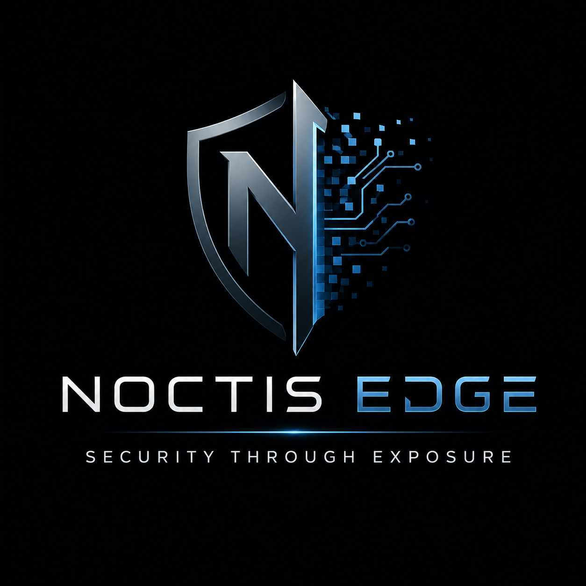

# Noctis Edge

<p align="center">
  
</p>

**Security Through Exposure**

Noctis Edge is a Python-based, AI-assisted vulnerability exposure and testing platform built around **local execution, data sovereignty, and operational security**.

Unlike cloud-dependent security platforms, **Noctis Edge runs entirely on your local machine**. All scanning, LLM-assisted analysis, CVE validation, and report generation happen on-device — no target data, credentials, or findings ever leave the host. It supports command-line execution via `noctis.py` and a browser-based Web UI via `noctis_web.py` (served locally at `http://127.0.0.1:8888`), without requiring external SaaS platforms, third-party APIs, or cloud processing.

This architecture makes Noctis Edge particularly suited for regulated environments, internal security teams, air-gapped networks, OT environments, and organizations where confidentiality and control are non-negotiable.

---

## Legal Disclaimer

Noctis-Edge is a defensive security and exposure validation platform intended exclusively for authorized security assessment, research, asset discovery, vulnerability validation, and compliance testing activities.

This software must only be used against systems, networks, applications, and infrastructure that you own or are explicitly authorized to test.

Unauthorized use of this software against third-party targets may violate local, state, federal, or international laws and regulations, including but not limited to unauthorized access, computer misuse, privacy, and cybersecurity legislation.

The authors, contributors, and distributors of Noctis-Edge:

- make no warranties regarding fitness for any purpose
- accept no liability for misuse, damage, downtime, data loss, or legal consequences resulting from use of this software
- do not endorse or support illegal, malicious, disruptive, or unethical activities

Users are solely responsible for:

- ensuring they have proper authorization before conducting any testing
- complying with all applicable laws, regulations, contracts, and organizational policies
- operating the software in a safe and responsible manner

Noctis-Edge is provided for lawful defensive security operations, security research, validation, monitoring, and educational purposes only.

By installing, configuring, or using this software, you agree that you are acting with proper authorization and assume full responsibility for your actions.

---


## What Gives Noctis the Edge

Most automated scanners report which CVEs *exist* on a system. **Noctis Edge tests whether they're actually exploitable** — and learns from every engagement it runs.

The `--cve-test` flag instructs the local LLM to generate safe, targeted probe scripts for each matched CVE. Scripts run on-device with a strict timeout and print a clear `VULNERABLE` / `NOT_VULNERABLE` / `INCONCLUSIVE` verdict. Results accumulate in `cve_knowledge_base.json` — on subsequent runs against the same CVE, proven scripts are replayed first, giving faster, higher-confidence results without any LLM call.

Noctis keeps active validation evidence-gated: HTTP-only tools such as Nikto, Nuclei, and ffuf are reserved for confirmed HTTP/HTTPS services, tool timeouts are recorded as explicit incomplete coverage, and low-confidence or product-mismatched CVEs are routed to manual review instead of generating broad active probes. CVE probe scripts are deduplicated and screened for placeholders, dummy targets, and protocol-mismatched raw probes before execution; rejected probes are reported separately and are not counted as negative evidence.

**Beyond CVEs — system hardening recommendations:** Noctis is not only a CVE scanner. Every scan automatically identifies insecure configurations, weak cryptographic settings, and policy gaps that represent real risk even without a named CVE. SSH services are audited for weak key-exchange algorithms, deprecated MACs, and password-authentication exposure. Web services are checked for missing security headers, unsafe HTTP methods, directory listing, exposed version banners, and misconfigured cookies. SMB and LDAP services are inspected for signing enforcement, anonymous access, and legacy protocol support. Each finding is tagged with its `vuln_type` (e.g. `WeakCipher`, `MissingHeader`, `Misconfiguration`), a `cwe_id` (e.g. CWE-326, CWE-16), and compliance control mappings (PCI-DSS, SOC2, ISO 27001, NIST CSF 2.0). The LLM then generates targeted short-term and long-term remediation advice for every finding — not generic hardening checklists, but advice anchored to the specific product, version, and configuration observed during the scan.

Running `./update.sh` submits your local CVE and Tooling knowledge bases to the community repository via Cloudflare relay — **no target data, credentials, or environment variables ever leave your machine**. Submissions are anonymised (CVE ID or service fingerprint only). Community-contributed scripts are vetted before inclusion. Pulling the aggregated community KB requires a [Noctis Edge Intelligence subscription](https://noctisedge.lemonsqueezy.com).

Alongside CVE probes, `tooling_knowledge_base.json` accumulates tool-performance data — which invocations produced real findings versus noise against specific service fingerprints. The LLM uses this history as context on each new engagement, progressively improving tool selection and script quality over time.

---

## System Requirements

| Component | Minimum |
|-----------|---------|
| **RAM** | 8 GB (16 GB recommended) |
| **Storage** | 15 GB free |
| **CPU** | 4 cores |
| **OS** | Kali / Parrot / Ubuntu / Debian-based / Docker on Linux/Mac/Windows |
| **Python** | 3.10+ |

**Storage breakdown (approximate):**

| Item | Size |
|------|------|
| Ollama — `qwen2.5-coder:3b-instruct` (all LLM tasks) | ~2 GB |
| Nuclei templates | ~1.5 GB |
| CVE offline database | ~3–5 GB |
| SecLists wordlists | ~2 GB |
| Tool binaries + Python venv | ~1 GB |
| Scan session outputs | Variable |

> **RAM note:** Only one model is needed (`qwen2.5-coder:3b-instruct`, ~2 GB). 8 GB RAM recommended; 16 GB optimal.

---

## Installation

Both paths provide identical functionality.

| | Docker | Native Linux |
|---|---|---|
| **OS** | Windows, macOS, Linux | Kali, Parrot, Ubuntu, Debian |
| **Setup time** | ~10 min (first build) | ~15 min |
| **Dependencies** | Docker Desktop only | apt + snap + Go + Ollama |
| **Isolation** | Full container isolation | System-level install |
| **Updates** | `docker compose build` + `pull` | `./update.sh` |

---

### Option A — Docker (Windows / macOS / Linux)

**Requirements:** [Docker Desktop](https://www.docker.com/products/docker-desktop/) (Windows/macOS) or Docker Engine + Compose plugin (Linux).

```bash
git clone https://github.com/PearceTech335/Noctis-Edge.git
cd Noctis-Edge
```

**Linux / macOS:**
```bash
chmod +x docker-run.sh && ./docker-run.sh
```

**Windows (PowerShell):**
```powershell
.\docker-run.ps1
```

The launcher script handles everything automatically: pulls latest source, builds the Docker image (all tools + offline CVE database baked in), starts the Ollama sidecar and downloads the LLM model (`qwen2.5-coder:3b-instruct` ~2 GB — one-time download, stored in a Docker volume), then starts the Web UI at **http://localhost:8888**.

**Useful Docker commands:**
```bash
docker compose run --rm noctis scan 192.168.0.1               # CLI scan
docker compose run --rm noctis scan 192.168.0.1 web --cve-test
docker compose down                                            # stop all containers
docker compose logs -f noctis                                  # live logs
docker compose build && docker compose up -d                   # rebuild after git pull
```

> **Network scanning note:** On Windows/macOS, Docker Desktop runs inside a VM — use `host.docker.internal` to scan the host machine instead of `127.0.0.1`.

> **GPU acceleration (optional):** Uncomment the `deploy.resources` block in `docker-compose.yml` to route Ollama inference through an NVIDIA GPU (`nvidia-container-toolkit` required on the host).

---

### Option B — Native Linux

> Full manual setup instructions: [Readme/requirements.md](Readme/requirements.md)

```bash
git clone --recurse-submodules https://github.com/PearceTech335/Noctis-Edge.git
cd Noctis-Edge
chmod +x setup.sh && ./setup.sh
```

`setup.sh` installs and configures (in order):

| Step | What gets installed |
|------|---------------------|
| Git submodules | `nikto/` (from [sullo/nikto](https://github.com/sullo/nikto)) |
| apt packages | `nmap`, `curl`, `ffuf`, `hydra`, `ssh-audit`, `dnsenum`, `dnsrecon`, `perl`, `golang-go`, `python3-tk`, and more |
| SecLists | Wordlists via `snap install seclists` |
| Nuclei | Go-based template scanner (`~/go/bin/nuclei`) |
| Ollama | Local LLM server + `qwen2.5-coder:3b-instruct` |
| Python venv | `.venv/` with `requests`, `jinja2`, `pycryptodome`, `flask`, `flask-sock` |
| CVE database | `CVE/cve-offline/` → `cve-summary.csv`; EPSS scores; NVD CVSS + CWE data |
| CWE dictionary | `CVE/cwe-data.csv` — MITRE weakness names, descriptions, consequences, mitigations (969 entries) |
| rdpscan | `rdpscan/` helper |
| Additional tools | `amass`, `metasploit-framework` |

After setup:
```bash
./noctis.py <target>   # Ollama starts automatically if not running
./noctis_web.py        # optional browser-based Web UI
```

---

## Quick Start

### Command Line

**Docker:**
```bash
docker compose run --rm noctis scan 192.168.0.1
docker compose run --rm noctis scan 192.168.0.1 web --cve-test
docker compose run --rm noctis scan 192.168.0.1 --nse-aggressive --msf-validate --cve-test
docker compose run --rm noctis scan 192.168.0.1 --resume
```

**Native Linux:**
```bash
./noctis.py 192.168.0.1                                         # default web profile
./noctis.py 192.168.0.1 web external api                        # multiple profiles merged
./noctis.py 192.168.0.1 web --cve-test --dns-enum
./noctis.py 192.168.0.1 --nse-aggressive --msf-validate --cve-test  # full aggressive run
./noctis.py 192.168.0.1 --resume                                # resume interrupted scan
```


---

## Command-Line Flags

| Flag | Description |
|------|-------------|
| `<target>` | IP address or hostname to scan (required) |
| `[profile]` | Assessment profile (default: `web`). Multiple profiles merge their tool lists. |
| `--nse-aggressive` | Disable safe mode — enables aggressive NSE script tier; runs ffuf and hydra without approval prompts |
| `--dns-enum` | Enable DNS enumeration tools (amass, dnsenum, dnsrecon) — requires internet access |
| `--msf-validate` | Non-destructively validate CVE matches using Metasploit safe checks; with `--cve-test`, runs post-positive check-only corroboration |
| `--cve-test` | Generate and execute LLM-driven probe scripts for each matched CVE |
| `--unattended` | Auto-approve all interactive prompts (useful for scripted/automated runs) |
| `--resume` | Resume the most recent interrupted scan session for this target |

---

## Assessment Profiles

Pass one or more profile names after the target. Tools from all selected profiles are deduplicated and merged.

| Profile | Focus | Key Tools |
|---------|-------|-----------|
| `web` | Web Application Assessment | curl, nikto, nuclei, ffuf |
| `external` | External Perimeter Review | nmap, curl, nuclei, ffuf, dns_enum |
| `internal_ad` | Internal AD Assessment | nmap, nxc (SMB/LDAP) |
| `api` | API Assessment | curl, nuclei, ffuf |
| `cloud` | Cloud Exposure Review | curl, nuclei, dns_enum |
| `ot` | Industrial / OT Assessment | nmap (OT-aware — skips ffuf/hydra/nuclei by default) |

---

## How It Works


```mermaid
flowchart TD
    TARGET(["Target: 192.168.1.1"]) --> S1

    subgraph STARTUP["① Startup"]
        S1["Ollama health-check and model pull"]
        S2["Validate tool binaries and print status table"]
        S1 --> S2
    end

    S2 --> N1

    subgraph NMAP["② Five-Phase Nmap Discovery"]
        N1["Phase 1 — Port sweep  -p- --min-rate 2000"]
        N2["Phase 2 — Service and version  -sV -sC"]
        N3["Phase 3 — NSE scripts\nsmb-enum-shares · smb-vuln-ms17-010 · smb-security-mode"]
        N4["Phase 4 — OS fingerprint  -O --osscan-guess"]
        N5["Phase 5 — Normalise and CVE lookup\nCVE-2017-0144 matched on SMB:445"]
        N1 --> N2 --> N3 --> N4 --> N5
    end

    N5 --> SVCS["Discovered Services\nSMB:445  ·  SSH:22  ·  HTTP:80"]

    SVCS --> P1

    subgraph PHASE1["③ Phase 1 — Parallel Planning Wave"]
        P1["LLM plans one initial action per service simultaneously\nKnown fingerprints use fast-path — no LLM call needed"]
        P2["All actions execute concurrently via asyncio.gather  MAX=4\ne.g. enum4linux-ng -A 192.168.1.1"]
        P1 --> P2
    end

    P2 --> L1

    subgraph PHASE2["④ Phase 2 — Per-Service Probe Loop  example: SMB:445"]
        L1["LLM selects next action\ne.g. nxc smb 192.168.1.1 --shares"]
        L2["Tool executes"]
        L3["Output parsed — findings added to context"]
        L4{"More useful actions\nand rounds remain?"}
        L5["Timeout recovery — partial output fed back\nLLM proposes alternative tool — recovery wave runs"]
        L1 --> L2 --> L3 --> L4
        L4 -->|"Yes — next round"| L1
        L4 -->|"Timeout"| L5
        L5 --> L1
    end

    L4 -->|"No — exhausted"| E1

    subgraph ENRICH["⑤ Verification and Enrichment"]
        E1["Re-verify finding — re-request to confirm not a false positive"]
        E2["Tag vuln_type · CWE ID · compliance controls\nPCI-DSS · SOC2 · ISO 27001 · NIST CSF 2.0"]
        E3["Risk score = severity x confidence x exposure x tool_confidence"]
        E1 --> E2 --> E3
    end

    E3 --> CVE_CHECK{"--cve-test\nenabled?"}

    CVE_CHECK -->|"Yes"| CT1
    CVE_CHECK -->|"No"| MSF_CHECK

    subgraph CVE_TEST["⑥a  --cve-test  example: CVE-2017-0144"]
        CT1["LLM generates up to 5 independent probe scripts per CVE\neach using a different technical strategy"]
        CT2["Scripts run in sandbox with 30 s timeout\nVERDICT: VULNERABLE / NOT_VULNERABLE / INCONCLUSIVE"]
        CT3{"2+ of 5\nverifiers confirm?"}
        CT4["CONFIRMED_VULNERABLE"]
        CT5["PROBABLE_VULNERABLE"]
        CT6["NOT_VULNERABLE or INCONCLUSIVE"]
        CT1 --> CT2 --> CT3
        CT3 -->|"Yes"| CT4
        CT3 -->|"Partial"| CT5
        CT3 -->|"No"| CT6
    end

    CT4 --> MSF_CHECK
    CT5 --> MSF_CHECK
    CT6 --> MSF_CHECK

    MSF_CHECK{"--msf-validate\nenabled?"}

    MSF_CHECK -->|"Yes"| M1
    MSF_CHECK -->|"No"| R1

    subgraph MSF["⑥b  --msf-validate"]
        M1["msfconsole safe check only — no payload and no exploitation\ne.g. use auxiliary/scanner/smb/smb_ms17_010 ; check"]
        M2{"Result?"}
        M3["Confirmed — verdict promoted to CONFIRMED_VULNERABLE"]
        M4["Inconclusive — recorded alongside existing verdict"]
        M1 --> M2
        M2 -->|"Vulnerable"| M3
        M2 -->|"Not vulnerable or unknown"| M4
    end

    M3 --> R1
    M4 --> R1

    subgraph REPORT["⑦ Report Generation"]
        R1["report_target.json  +  report_target.html"]
        R2["Executive summary · CVE badges · Compliance chips\nFindings with evidence · Attacker perspective · LLM conclusion"]
        R1 --> R2
    end

    R2 --> DONE(["Session saved to sessions/ — resumable with --resume"])
```

### 1. Startup Checks
- Starts `ollama serve` automatically if not running (waits up to 30 s)
- Pulls configured models if not present locally
- Validates all tool binaries and prints a status table

### 2. Five-Phase Nmap Discovery

| Phase | nmap flags | Output |
|-------|------------|--------|
| **1 — Host Discovery & Port List** | `-Pn -T4 --open -p- --min-rate 2000` | All open TCP ports |
| **2 — Service & Version Enumeration** | `-sV -sC -T4 -p <ports>` | Banners, version strings, product names |
| **3 — NSE Script Execution** | `--script <service-targeted NSE scripts>` | HTTP headers/methods, SSH algorithms, SMB shares, SSL ciphers, etc. |
| **4 — OS Detection** | `-O --osscan-guess` | OS fingerprint with confidence % |
| **5 — Normalise** | (in-process) | All phases merged into unified service list; NSE output and OS context attached per port |

Phase 3 uses a service-to-NSE-script map to select the most relevant scripts per service type. As of v0.9.1 the map covers 36 service entries — for example HTTP/alt-HTTP/proxy gets `http-title,http-headers,http-methods,http-auth-finder,http-robots.txt,http-cookie-flags,http-cors,http-git,http-waf-detect,http-php-version`; HTTPS additionally runs `ssl-heartbleed,ssl-dh-params,ssl-poodle,tls-ticketbleed`; SSH gets `ssh-auth-methods,ssh2-enum-algos,ssh-hostkey,sshv1`; SMB gets `smb-enum-shares,smb-security-mode,smb-vuln-ms17-010,smb-double-pulsar-backdoor`; specialised entries also cover Redis, MongoDB, CouchDB, NFS, IPMI, Docker API, X11, and more. The full NSE output is injected into every subsequent LLM planning prompt.

CVE lookups run against the normalised service list after Phase 5 completes.

### 3. LLM-Driven Scan — Phase 1 (Parallel)

1. The LLM analyzes all discovered services at once (with NSE context) and returns a JSON array of one initial tool per service — or a deterministic fast-path map is used for well-known service fingerprints (SMB, RDP, SSH, FTP, etc.), eliminating LLM calls entirely for common targets.
2. All actions in the wave run concurrently via `asyncio.gather()`, bounded by `MAX_PARALLEL_ACTIONS` (default 4).
3. Findings are enriched, verified, and auto-tagged before being passed into Phase 2 context.

### 4. LLM-Driven Scan — Phase 2 (Sequential Loop)

The loop deepens investigation, asking the LLM what to do next based on the target, discovered services, NSE results, all findings so far, tool run history, and disabled tools. The LLM responds with a single JSON action `{"tool": "<name>", "args": "<value>"}`. Noctis executes it, parses findings, and feeds results back into context.

Tools that time out with no findings are auto-disabled for the session. In `SAFE` mode (default), aggressive tools (ffuf, hydra) require operator approval before running.

### 5. Finding Verification & Enrichment

After each tool run, findings are:
- **Verified** — re-requesting a discovered path to confirm it is real rather than a false positive
- **Enriched** — `vuln_type` (e.g. RCE, SQLi, XSS), `cwe_id` (e.g. CWE-89), and `compliance_controls` (PCI-DSS, SOC2, ISO 27001, NIST CSF 2.0) inferred via internal mapping tables

### 6. Risk Scoring

```
risk_score = severity_weight × confidence × exposure × tool_confidence
```

| Factor | Values |
|--------|--------|
| `severity_weight` | critical=1.0, high=0.8, medium=0.5, low=0.2, info=0.05 |
| `confidence` | set by tool parser (e.g. curl=0.90, nikto=0.40) |
| `exposure` | 1.2 if internet-facing, 1.0 internal |
| `tool_confidence` | per-tool weighting from config |

### 7. Report Generation

Reports are saved to `sessions/<target>_<timestamp>/`:
- `report_<target>.json` — full machine-readable report
- `report_<target>.html` — styled HTML report with collapsible sections

Reports include: Executive Summary (severity counts), Compliance Impact (PCI-DSS / SOC2 / ISO 27001 / NIST CSF 2.0 control chips), Service Inventory with CVE badge links, Findings (severity, tool, risk score, verification status, CWE, evidence, raw HTTP response, command run), CVE Matches (CVSS v3.1/v4.0, EPSS exploit probability, attacker perspective, immediate remediation path), MSF/CVE test results, and LLM-generated conclusion.

### 8. Session Persistence

After each tool run the current state is saved to `sessions/<id>/session.json`. Use `--resume` to continue after an interruption.

---

## Optional Phases

### `--msf-validate`

When used without `--cve-test`, after the main scan Noctis checks matched CVEs with the safe Metasploit validation path:
1. Searches Metasploit for a module matching the CVE ID
2. If a safe check path exists, runs `msfconsole -x "use <module>; set RHOSTS <target>; check; exit"` — MSF's non-destructive `check` command (no payload, no exploitation)
3. Result (`vulnerable`, `not vulnerable`, `unknown`, `no module`, or `blocked`) is recorded in the report

When combined with `--cve-test`, broad MSF validation is deferred. MSF runs only after another CVE probe reports `VULNERABLE`, and only uses check-only validation as independent corroboration. A positive MSF check can promote the CVE to `CONFIRMED_VULNERABLE`; an inconclusive, unsupported, blocked, or not-exploitable MSF result is recorded but does not erase the original finding.

Requires `msfconsole` on PATH. Requires operator approval in SAFE mode.

### `--cve-test`

After the main scan:
1. Shows an approval prompt listing the CVEs to be tested
2. For each CVE, replays trusted KB and Nuclei evidence first, then asks the LLM to generate up to **5 independent probe scripts** (Python or Bash), each using a different technical strategy
3. Scripts are written to `sessions/<id>/cve_tests/` and executed with a 30-second timeout
4. Each script must print one of: `VERDICT: VULNERABLE`, `VERDICT: NOT_VULNERABLE`, `VERDICT: INCONCLUSIVE`
5. If any valid probe reports `VULNERABLE`, Noctis runs **5 independent verifier scripts** and requires **2 verifier confirmations** before treating the CVE as confirmed
6. If `--msf-validate` is also enabled, Noctis then runs post-positive MSF check-only validation as an additional corroboration path
7. Results are tallied into an overall per-CVE verdict and written into the reports

**Verdicts:**
- `CONFIRMED_VULNERABLE` — at least 2 of 5 independent verifiers confirm, or MSF check-only validation confirms
- `PROBABLE_VULNERABLE` — one verifier confirms or multiple active probes report VULNERABLE, but the confirmation threshold is not met
- `MATCHED_VERSION` — a single unconfirmed vulnerable signal or version/banner match; manual verification recommended
- `NOT_VULNERABLE` — majority NOT_VULNERABLE with no VULNERABLE result
- `NOT_TESTABLE` — every available probe was rejected before execution as low-quality, placeholder, duplicate, or protocol-mismatched
- `INCONCLUSIVE` — probes ran but could not determine status (timeout, wrong protocol, banner-only, etc.)

**Knowledge Base:** Results are persisted in `cve_knowledge_base.json`. On future runs, previously successful scripts for the same CVE are replayed first, improving confidence without LLM generation. Running `./update.sh` submits this file to the community relay. Pulling the aggregated community KB requires a subscription token.

> **Note:** These are heuristic probes generated by a small local LLM, not actual exploit chains. `MATCHED_VERSION` and `PROBABLE_VULNERABLE` are leads to investigate; `CONFIRMED_VULNERABLE` requires verifier agreement or MSF check-only corroboration.

---

## Output Structure

```
sessions/
└── localhost_20260424_102554/
    ├── session.json              ← live state (for --resume)
    ├── report_localhost.json     ← full JSON report
    ├── report_localhost.html     ← styled HTML report
    └── cve_tests/
        ├── CVE-2002-1367_attempt_01.py
        ├── CVE-2002-1367_attempt_02.sh
        └── ...

cve_knowledge_base.json           ← cross-engagement CVE test KB (project root)
                                     gitignored; submitted to community by ./update.sh
```

---

## Configuration

Top-of-file constants in `noctis.py` (all overridable via environment variables). The default deployment uses one physical Ollama model for every LLM role:

| Constant | Default | Env var | Description |
|----------|---------|---------|-------------|
| `MODEL` | `qwen2.5-coder:3b-instruct` | `NOCTIS_OLLAMA_MODEL` | Planning, iteration decisions, structured JSON tool selection |
| `SCRIPT_MODEL` | `qwen2.5-coder:3b-instruct` | `NOCTIS_OLLAMA_SCRIPT_MODEL` | CVE exploit scripts, verification scripts, executive summary, audit, attacker perspectives, per-finding descriptions |
| `CVE_SCRIPT_MODEL` | *(same as `SCRIPT_MODEL`)* | `NOCTIS_OLLAMA_CVE_SCRIPT_MODEL` | CVE probe generation — optional advanced override; unset by default so no second model is required |
| `OLLAMA_URL` | `http://localhost:11434/api/generate` | — | Ollama API endpoint |
| `MAX_ITERATIONS` | `10` | — | Minimum (floor) Phase 2 iteration count — applied when few services detected |
| `MAX_ITERATIONS_CAP` | `40` | — | Hard ceiling — dynamic budget and auto-extensions can never exceed this |
| `MAX_EXTEND_ONCE` | `20` | — | Extra iterations granted by operator approval once the hard ceiling is hit (interactive only) |
| `MAX_EXTENSION_BUDGET` | `8` | — | Total auto-granted extension iterations from uninvestigated findings (+2 per finding) |
| `MAX_PARALLEL_ACTIONS` | `4` | — | Max concurrent tools in the Phase 1 parallel wave |
| `MAX_LLM_RETRIES` | `3` | — | LLM call retries per iteration |
| `CVE_TEST_ATTEMPTS` | `5` | — | LLM script attempts per CVE in `--cve-test` |
| `SAFE_MODE` | `True` | — | Require approval for aggressive tools (override with `--nse-aggressive`) |
| `UNATTENDED` | `False` | — | Auto-approve all prompts (override with `--unattended`) |

---

## Tools Used

| Tool | Purpose |
|------|---------|
| `nmap` | Five-phase discovery: full port scan → service/version enumeration → targeted NSE scripts → OS detection → normalisation |
| `curl` | HTTP probing |
| `nikto` | Web server vulnerability scanning (bundled in `nikto/`) |
| `nikto_cgi` | Web server vulnerability scanning with `-C all` — exhaustive CGI scan; auto-selected for all HTTP/HTTPS services in Phase 1 |
| `nuclei` | Template-based scanning |
| `ffuf` | Directory and web fuzzing (rate-limited, auto-calibrated; HTTP/HTTPS only) |
| `hydra` | Credential brute-forcing (aggressive mode only) |
| `ssh-audit` | SSH configuration auditing |
| `amass` | Subdomain enumeration (internet required) |
| `dnsenum` / `dnsrecon` | DNS enumeration (internet required) |
| `nxc` (NetExec) | SMB/LDAP enumeration for AD assessments |
| `msfconsole` | MSF validation (`--msf-validate`) |
| `rdpscan` | RDP enumeration |

> **Note:** `nikto/` is a git submodule pointing to [sullo/nikto](https://github.com/sullo/nikto). Clone with `--recurse-submodules` or run `git submodule update --init --recursive` after cloning.

Install notes: see [Readme/requirements.md](Readme/requirements.md).

---

## Ollama Setup

`setup.sh` installs Ollama and pulls the single model automatically. `noctis.py` will also start `ollama serve` automatically and pull any missing model before the scan begins.

Manual install:
```bash
curl -fsSL https://ollama.com/install.sh | sh
ollama pull qwen2.5-coder:3b-instruct      # planning, scripts, and all report prose
```

### Model Roles

| Model | Env var | Purpose |
|-------|---------|---------|
| `qwen2.5-coder:3b-instruct` | `NOCTIS_OLLAMA_MODEL` | Tool selection, scan planning, structured JSON decisions |
| `qwen2.5-coder:3b-instruct` | `NOCTIS_OLLAMA_SCRIPT_MODEL` | CVE exploit/verification scripts, executive summary, attacker perspectives, per-finding descriptions |
| `qwen2.5-coder:3b-instruct` | `NOCTIS_OLLAMA_CVE_SCRIPT_MODEL` | CVE probe generation; optional advanced override, unset by default |

`qwen2.5-coder:3b-instruct` is ~2 GB. Only one model is needed by default — no report-model download and no model-swap overhead. Inference is typically 20–90 s per call on CPU-only hardware after the initial warm load.

---

## Community Knowledge Base

`cve_knowledge_base.json`, `nuclei_kb.json`, and `tool_knowledge_base.json` accumulate test results and tool-performance data at the project root. Each entry is identified only by CVE ID, Nuclei template ID, or service fingerprint — **no target-specific information is recorded**. All three files are gitignored and never committed.

Running `./update.sh` submits all three files to the community relay via the Cloudflare Worker (`cloudflare/worker.js`). The worker source is included in this repository for full transparency. Your installation ID (generated once by `setup.sh`, stored in `noctis.conf`) is used only to rate-limit submissions (4 per day) and is never linked to personal data.

### Unlocking the Community Knowledge Base

Subscribers receive access to the aggregated community CVE and tool knowledge bases. Once you have subscribed at [noctisedge.lemonsqueezy.com](https://noctisedge.lemonsqueezy.com):

1. Open `noctis.conf` and add your license key:
   ```ini
   KB_LICENSE_KEY=XXXX-XXXX-XXXX-XXXX
   ```
2. Run `./update.sh` — the community KB is downloaded and additively merged into your local knowledge base.

---

## Application Maintenance

```bash
./update.sh
```

| Step | What happens |
|------|--------------|
| 1 | apt packages upgraded |
| 2 | SecLists (snap) refreshed |
| 3 | pip dependencies upgraded |
| 4 | Nuclei binary + templates updated |
| 5 | Ollama models pulled |
| 5a | EPSS offline database refreshed (daily exploit-probability scores, 330k+ CVEs) |
| 5b | NVD CVSS offline database updated (real CVSS v3.1/v4.0 + authoritative CWE IDs from NVD JSON 2.0 feeds) |
| 5c | CWE offline dictionary refreshed (MITRE CWE XML — weakness names, descriptions, consequences, mitigations; 969 entries) |
| 5d | CISA KEV catalog refreshed (CISA Known Exploited Vulnerabilities — active exploitation ground truth, used to boost risk scores and flag MUST-PATCH findings) |
| 6 | CVE offline database pulled + CSV rebuilt |
| 7 | Noctis Edge source updated (`git fetch` + `git reset --hard origin/master`); Docker image rebuilt if Docker is detected |
| 8 | Nikto submodule updated |
| 9–10 | CVE, Nuclei template, and Tool knowledge bases submitted to community relay; community KBs pulled if `KB_LICENSE_KEY` is set |

> **Data safety:** `git reset --hard` only affects git-tracked files. All user data lives in gitignored paths (`sessions/`, `noctis.conf`, `cve_knowledge_base.json`, `tool_knowledge_base.json`) and is never touched by the update.

---

## Scripts

| Script | Purpose |
|--------|---------|
| `setup.sh` | One-shot setup for a fresh install. Generates a unique installation ID stored in `noctis.conf`. |
| `update.sh` | Refresh all components and submit local knowledge bases to the community relay. |
| `scripts/build_cwe_db.py` | Downloads MITRE CWE XML dictionary; writes `CVE/cwe-data.csv` (969 weakness entries with names, descriptions, consequences and mitigations). |
| `scripts/build_epss_db.py` | Downloads daily FIRST.org EPSS scores to `CVE/epss-scores.csv`. Called by `update.sh` step 5a and `docker-entrypoint.sh`. |
| `scripts/build_nvd_cvss.py` | Incrementally downloads NVD JSON 2.0 feeds; writes `CVE/nvd-cvss.csv` with CVSS v3.1/v4.0 scores and authoritative CWE IDs. |
| `scripts/build_kev_db.py` | Downloads the CISA Known Exploited Vulnerabilities catalog to `CVE/kev-catalog.csv`. Called by `update.sh` step 5d and `docker-entrypoint.sh`. |
| `scripts/submit_kb.py` | POSTs the local CVE knowledge base to the Cloudflare relay. Called automatically by `update.sh`. |
| `scripts/merge_kb.py` | Additively merges an external CVE knowledge base JSON into the local one. |
| `scripts/submit_nuclei_kb.py` | POSTs the local Nuclei template knowledge base to the Cloudflare relay. Called automatically by `update.sh`. |
| `scripts/submit_tool_kb.py` | POSTs the local tool performance knowledge base to the Cloudflare relay. Called automatically by `update.sh`. |
| `scripts/merge_tool_kb.py` | Additively merges an external tool knowledge base JSON into the local one. |

---

## Cloudflare Relay

The `cloudflare/` directory contains the Cloudflare Worker that relays KB submissions to the community repository.

| File | Purpose |
|------|---------|
| `cloudflare/worker.js` | Worker source — validates, rate-limits, and writes submissions to GitHub |
| `cloudflare/wrangler.toml` | Wrangler deployment config (KV bindings, route) |

| Route | Method | Purpose |
|-------|--------|---------|
| `/submit` | POST | CVE KB submission |
| `/community-kb` | POST | CVE community KB pull (license-gated) |
| `/submit-tool` | POST | Tool KB submission |
| `/community-tool-kb` | POST | Tool community KB pull (license-gated) |
| `/submit-nuclei` | POST | Nuclei template KB submission |

The worker is already deployed at `https://noctis-kb-relay.pearcetechnologies1.workers.dev`. End users do not need to deploy anything.

---

## What Is NOT Committed to Git

| Path | Reason |
|------|--------|
| `sessions/` | Runtime scan output — local to each installation |
| `noctis.conf` | Per-user config (UUID, license key) |
| `cve_knowledge_base.json` | Machine-specific CVE test results |
| `nuclei_kb.json` | Machine-specific Nuclei template performance data |
| `tool_knowledge_base.json` | Machine-specific tool performance data |
| `cloudflare/.wrangler/` | Wrangler cache (contains Cloudflare account credentials) |
| `WordLists/rockyou.txt` | 139 MB — not needed for directory enumeration |
| `CVE/cve-offline/cve-summary.csv` | 57 MB — regenerated by `updatecsv.sh` |
| `CVE/cve-offline/` | Separate git repo |
| `CVE/.nvd-cache/` | NVD CVSS download cache — large intermediate `.json.gz` files |
| `rdpscan/` | Separate git repo |

---

## Version History

**Current version: v0.11.2**

### v0.11.2 — Patch Release

- **Ollama concurrency cap** — `threading.Semaphore(3)` (overridable via `NOCTIS_LLM_CONCURRENCY`) limits concurrent Ollama planning calls to 3. Previously, scans with many services (e.g. 21) flooded Ollama's request queue, causing the last-queued calls to exceed the 600 s read timeout before inference had even started.
- **Tool timeout retry-with-feedback** — timed-out tools now feed their selection reason and partial output back to the LLM, which suggests an alternative. A recovery wave runs immediately with one extra probe round granted per recovery.
- **Executive summary retry loop fixed** — guard rejections now `continue` instead of `break`; `_build_conclusion_with_cve` gained a full `MAX_LLM_RETRIES` loop with backoff.
- **Hallucination guard narrowed** — `\bcritical\b` tightened to explicit severity-label patterns (`critical severity`, `critical finding(s)`, `critical vulnerability/vulnerabilities`).
- **NSE script policy system** — selection now driven by `safe/aggressive/unsafe_nse_scripts.json` policy files with denylist validation instead of a hard-coded map.
- **CVE rejection reasons** — `_cve_service_rejection_reason()` rejects product-mismatched CVE candidates with logged reasons; `_match_cves_for_service()` returns a 3-tuple `(active, suppressed, rejected)`.
- **`CVE_LOW_CONFIDENCE_THRESHOLD` raised** `0.35 → 0.50`.
- **Web UI** UNSAFE banner rebuilt with inline JS `style.display` control.
- **`.gitignore` hardened** — `*.bak`, `fix_funcs.py`, `_scan_*.log`, `build*.log` added.

---

### v0.11.0 — CVE Matching, Version Range, and Reporting

- CVE matching enforces strict product, vendor, and version correlation. Each match carries a `cve_match_status` and `version_range_check` annotation visible in the report.
- Attacker perspectives and remediation advice enforce strict sentence and length limits to avoid risk inflation.
- HTML report displays CVE match status, version range, and severity badges. Suppressed and not-affected CVEs are separated with visible reasons.
- All LLM-generated sections (attacker perspective, remediation, executive summary) validated for accuracy and tone before render.

---

For the complete release history see [version_history.md](version_history.md).

---

## Credits

| Tool / Library | Author / Org | Purpose |
|----------------|-------------|---------|
| [Nikto](https://github.com/sullo/nikto) | Chris Sullo | Web server vulnerability scanner (bundled as submodule) |
| [Nuclei](https://github.com/projectdiscovery/nuclei) | ProjectDiscovery | Template-based vulnerability scanning |
| [nmap](https://nmap.org) | Gordon Lyon (Fyodor) | Network discovery and port scanning |
| [ffuf](https://github.com/ffuf/ffuf) | Joona Hoikkala | Fast web fuzzer |
| [Hydra](https://github.com/vanhauser-thc/thc-hydra) | van Hauser / THC | Login brute-force testing |
| [ssh-audit](https://github.com/jtesta/ssh-audit) | Joe Testa | SSH configuration auditing |
| [Amass](https://github.com/owasp-amass/amass) | OWASP | Network attack surface mapping |
| [Metasploit Framework](https://github.com/rapid7/metasploit-framework) | Rapid7 | Exploitation framework for MSF validation |
| [rdpscan](https://github.com/robertdavidgraham/rdpscan) | Robert David Graham | RDP vulnerability scanning |
| [Ollama](https://ollama.com) | Ollama, Inc. | Local LLM server |
| [trickest/cve](https://github.com/trickest/cve) | Trickest | CVE PoC reference database (submodule) |
| [trickest/cve-offline](https://github.com/trickest/cve-offline) | Trickest | Offline CVE CSV dataset |
| [SecLists](https://github.com/danielmiessler/SecLists) | Daniel Miessler | Security wordlists |
| [NetExec (nxc)](https://github.com/Pennyw0rth/NetExec) | Pennyw0rth | Network service execution and enumeration |
| [Flask](https://flask.palletsprojects.com) | Pallets | Web framework for the browser UI |
| [flask-sock](https://github.com/miguelgrinberg/flask-sock) | Miguel Grinberg | WebSocket support for Flask |
| [Requests](https://requests.readthedocs.io) | Kenneth Reitz | HTTP library |
| [Jinja2](https://jinja.palletsprojects.com) | Pallets | HTML report templating |
| [PyCryptodome](https://pycryptodome.readthedocs.io) | Legrandin | Cryptographic primitives |
